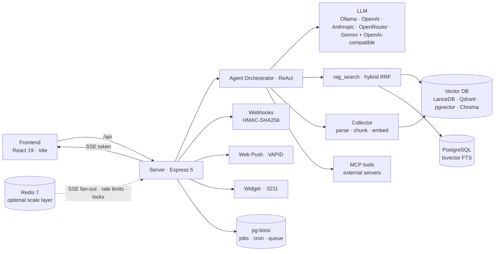

# Simmetric Chat

Enterprise-grade, local-first, privacy-first AI chat workspace with RAG, RBAC, and full air-gap capability.

[](LICENSE)
[](https://nodejs.org)
[](https://pnpm.io)
[](CONTRIBUTING.md)

<!-- To add a hero screenshot, place it at docs/assets/hero.png and replace this comment with:

-->

Simmetric Chat pairs a ReAct agent with hybrid RAG search, role-based access control, and an embeddable chat widget — deployable fully air-gapped with zero cloud dependencies. External website visitors can chat with an AI assistant powered by the platform's RAG knowledge, while internal teams get a full chat workspace with fine-grained permissions.

> *AI ChatBot and RAG for strict data residency, offline operation, and fine-grained access control.*

📖 **[Full documentation](docs/INDEX.md)** — start at `docs/INDEX.md` for the canonical dev docs (architecture, getting started, development, testing, configuration, API, deployment, widget, contributing).

---

## Why Simmetric Chat?

- 🛡️ **Privacy-first & air-gap ready** — runs fully offline with Ollama (local LLM), LanceDB (local vector store), and Xenova transformers (local embeddings). Zero cloud dependencies. A DLP filter redacts PII (email, credit cards, API keys, private keys) before it ever leaves your network.

- 🔎 **RAG with citations + RBAC** — hybrid vector + PostgreSQL full-text search fused with Reciprocal Rank Fusion (RRF), with source citations and relevance scores in every response. 31 permissions across 13 menu sections, workspace-level access grants, and IDOR prevention keep knowledge siloed by design.

- 🧩 **Embeddable widget** — iframe/script embeddable chat widgets for external websites, with isolated anonymous sessions, rate limiting, layered knowledge-base access, and lead capture. Powered by the same RAG pipeline and agent infrastructure as the internal chat. (Enterprise tier.)

- 🤖 **Multi-LLM + MCP** — Ollama, OpenAI, Anthropic, OpenRouter, Gemini, and 20 provider presets (16 one-click installable + 4 OAuth/manual references) (DeepSeek, Mistral, Kimi/Moonshot, NVIDIA NIM, OpenAI Codex, Qwen, xAI, Z.AI/GLM, MiniMax, LM Studio, GitHub Copilot, and more) with per-chat model selection, a Cmd+K quick-switch palette, side-by-side model comparison, and graceful fallback when a model becomes unavailable. Bidirectional MCP: expose RAG to IDEs, or connect external MCP servers as agent skills via the marketplace.

---

## Features at a glance

- **Hybrid RAG** — vector + PostgreSQL FTS (RRF), source citations, document upload (PDF/MD/CSV/DOCX/XLSX/PPTX, YouTube transcripts)
- **ReAct agent** — reason-then-act orchestrator with built-in skills (`rag_search`, `workspace_memory`, `document_temp_process`) and pluggable MCP tools
- **Multi-LLM** — Ollama / OpenAI / Anthropic / OpenRouter / Gemini + 20+ OpenAI-compatible providers (DeepSeek, Mistral, Kimi/Moonshot, Qwen, xAI, Z.AI/GLM, MiniMax, LM Studio, GitHub Copilot, …), per-chat selection, palette, comparison, graceful fallback
- **RBAC** — 31 permissions, 13 menu sections, workspace + project access grants, IDOR prevention
- **Embeddable widget** — iframe/script embed, isolated sessions, lead capture, layered knowledge access (Enterprise)
- **OCR** — server-side vision-model OCR for image-based PDFs and scanned documents
- **Synthesis pipeline** — multi-document synthesis with contradiction detection, budget tracking, and selective approval
- **Backups** — scheduled and on-demand, encrypted, with retention policies (Enterprise; scheduler lives in the enterprise package)
- **i18n** — 8 locales (en, it, ru, de, fr, es, zh, pt — pt added 2026-08-26) with parity checks
- **Analytics** — token usage dashboards (daily, by model, top users)
- **Webhooks + Web Push** — HMAC-SHA256 signed webhooks and VAPID browser push (always-on in Community)
- **HMAC API keys** — `sk-` prefixed keys verified with a dedicated HMAC-SHA256 secret (`API_KEY_HMAC_SECRET`), decoupled from JWT/encryption key rotation
- **Job queue** — pg-boss (Postgres-backed) for 8 cron schedulers; OCR + synthesis pipelines stay as setInterval 10s pollers — works across instances, no extra infrastructure
- **Multi-instance scaling** — horizontally scalable server behind a load balancer: Redis-backed rate limits, JWT revocation, SSE fan-out relay, and distributed locks (graceful in-memory fallback for single-instance setups)
- **Enterprise license tiers** — Community vs Enterprise, feature-flagged (SSO, immutable audit logs, white-label, backups, custom agents, numeric limits) with graceful degradation

Full feature guide: [docs/USAGE.md](docs/USAGE.md).

---

## Quick Start (60s)

**Prerequisites:** Node.js ≥ 24, pnpm 11.24.0 (`corepack enable && corepack prepare pnpm@11.24.0 --activate`), and [Ollama](https://ollama.com) for local LLMs.

```bash
# 1. Pull the default local model
ollama pull gemma4:latest

# 2. Clone and install
git clone git@github.com:simooooone/simoschat-improved.git simmetric-chat
cd simmetric-chat
pnpm install

# 3. Configure — root .env is THE single runtime config (the per-package
#    .env override layer was removed)
cp .env.example .env
# Set at minimum: JWT_SECRET=$(openssl rand -hex 32) and COLLECTOR_SECRET=$(openssl rand -hex 32)

# 4. Initialize the database (needs a PostgreSQL 16 instance — see docker/docker-compose.infra.yml)
pnpm db:generate
pnpm --filter server db:migrate
pnpm --filter server db:seed   # optional — see note below

# 5. Start all services
pnpm dev
```

Open **http://localhost:5173**. A setup wizard (SetupWizard) renders when `setupWizardMode === 'active'` on a fresh DB. Two admin paths exist: run `pnpm --filter server db:seed` to seed roles, permissions, templates, and an `admin` / `admin123` account (Path A), or skip seeding and let the server auto-seed the bootstrap admin on startup (`SEED_BOOTSTRAP_ADMIN=true` by default; credentials from `SEED_ADMIN_USERNAME`/`SEED_ADMIN_PASSWORD`/`SEED_ADMIN_EMAIL`, defaults `admin` / `admin123` / `admin@example.com`). In both cases the seeded account carries `mustChangePassword=true`, so on first login `ForcePasswordChange.tsx` blocks the app until you set a new password via `/api/auth/set-initial-password`. Self-service registration is closed by default; additional users are created by an admin from Settings.

> Services: frontend `:5173` · server `:3000` · collector `:3210` · widget `:3211`.

---

## Architecture



Monorepo packages: `@simmetric-chat/shared` ← `@simmetric-chat/server`, `@simmetric-chat/collector`, `@simmetric-chat/frontend`, `@simmetric-chat/widget`. Strict unidirectional dependency graph — `shared` is the only cross-package import; server and collector never import from each other and communicate via HTTP only.

Deep dive: [docs/ARCHITECTURE.md](docs/ARCHITECTURE.md).

---

## Tech Stack

| Layer | Technology |
|---|---|
| Backend | Node.js, Express 5, Prisma ORM |
| Frontend | React 19, Vite 8, Tailwind CSS 4, react-router-dom 7 |
| State | TanStack Query + React Context (no Zustand) |
| Database | PostgreSQL 16 |
| Scale layer (optional) | Redis 7 — auth cache, token revocation, SSE fan-out, distributed locks, Redis-backed rate limits (graceful in-memory fallback when absent) |
| Job queue | pg-boss (Postgres-backed) — 8 cron schedulers (reapers, fidelity sampling, wiki consistency, MCP health checks); OCR + synthesis pipelines stay as setInterval 10s pollers |
| Schema/migrations | Prisma 7 (`@prisma/adapter-pg` driver adapter) — Prisma client singleton at `packages/server/src/utils/prisma.ts` |
| Vector DB | LanceDB (local) · Qdrant · pgvector · Chroma |
| Embeddings | Xenova/Transformers (local) · HuggingFace v4 · Ollama · OpenAI |
| LLM | Ollama (local) · OpenAI · Anthropic · OpenRouter · Gemini + OpenAI-compatible (DeepSeek, Mistral, Kimi/Moonshot, Qwen, xAI, Z.AI/GLM, MiniMax, LM Studio, GitHub Copilot, …) |
| Auth | JWT + bcrypt, HMAC-SHA256 API keys (`sk-` prefix), RBAC middleware |
| Streaming | SSE via `@microsoft/fetch-event-source` |
| Monorepo | pnpm workspaces (pnpm 11.24.0 pinned via `packageManager`) + Turborepo |
| Desktop | Tauri v2 (optional — `src-tauri/` desktop shell) |

> **Enterprise plugin** — optional proprietary package (separate private repo, `simmetric-enterprise/`) loaded at boot via `require.resolve` from `packages/server/src/services/enterpriseLoader.ts`. It imports only `@simmetric-chat/shared`; when absent the server runs in Community mode via graceful degradation. See [docs/ENTERPRISE_PLUGIN.md](docs/ENTERPRISE_PLUGIN.md).

---

## Documentation

| Doc | Purpose |
|---|---|
| [docs/INDEX.md](docs/INDEX.md) | Documentation hub |
| [docs/GETTING_STARTED.md](docs/GETTING_STARTED.md) | Install, configure, first run |
| [docs/USAGE.md](docs/USAGE.md) | Feature guide (chat, documents, widgets, MCP, settings) |
| [docs/ADMIN.md](docs/ADMIN.md) | RBAC, roles, license management, admin tasks |
| [docs/WIDGET.md](docs/WIDGET.md) | Embeddable widget integration guide |
| [docs/ARCHITECTURE.md](docs/ARCHITECTURE.md) | Architecture deep dive |
| [docs/API.md](docs/API.md) | API reference |
| [docs/CONFIGURATION.md](docs/CONFIGURATION.md) | Full configuration |
| [docs/DEPLOYMENT.md](docs/DEPLOYMENT.md) | Deployment guide |
| [docs/DEVELOPMENT.md](docs/DEVELOPMENT.md) | Development setup |
| [docs/TESTING.md](docs/TESTING.md) | Testing guide |
| [docs/SCALING.md](docs/SCALING.md) | Multi-instance horizontal scaling guide (Redis layer, SSE fan-out, pg-boss) |
| [docs/ENTERPRISE_PLUGIN.md](docs/ENTERPRISE_PLUGIN.md) | Enterprise plugin model, PluginContext contract, air-gap install runbook |

Interactive API docs (Swagger / OpenAPI 3.0) are served at `/api-docs` when the server is running.

---

## Deployment

```bash
docker compose -f docker/docker-compose.yml up --build -d
```

Full guide (multi-container Compose, single-container all-in-one for air-gapped environments, dev overrides): [docs/DEPLOYMENT.md](docs/DEPLOYMENT.md).

Horizontal scaling (N server instances behind a load balancer with shared Postgres + Redis, SSE fan-out, pg-boss job queue): [docs/SCALING.md](docs/SCALING.md).

---

## Configuration

The repo-root `.env` is the **single runtime config file** (Phases 176–177, per-package layer removed): copy `.env.example` to `.env` and fill in the bootstrap secrets (`JWT_SECRET`, `COLLECTOR_SECRET`; optional `WIDGET_API_KEY`, `API_KEY_HMAC_SECRET`, `ENCRYPTION_KEY`, `REDIS_URL`, `LICENSE_KEY`). The root `.env.example` documents **every** schema key of every package, organized in per-package sections with `[server]`/`[collector]`/`[widget]` applicability markers (guarded by the `envExampleParity` tripwires). Packages load the root file via a zero-dependency `loadRootEnv()` loader in `@simmetric-chat/shared` (marker-walk discovery — walks up parent directories until it finds `pnpm-workspace.yaml`). Precedence: `process.env` > root `.env` > code default; the per-package `.env` files no longer exist. The strictly required keys (Zod `.min(1)` in `packages/server/src/config/env.ts`) are `JWT_SECRET` and `COLLECTOR_SECRET` — `DATABASE_URL` has a code default and `LICENSE_KEY` is optional (absent = Community build). Runtime configuration precedence: `ALWAYS_READONLY` infra keys are ENV-only; every other UI-editable setting resolves DB > ENV > default.

Full details: [docs/CONFIGURATION.md](docs/CONFIGURATION.md).

---

## Contributing

Contributions are welcome! By submitting a pull request, you agree to the
[Contributor License Agreement](CLA.md) (v1.0). Include this line in your PR
description:

```
I have read and agree to the Simmetric Chat Contributor License Agreement (v1.0).
```

See [CONTRIBUTING.md](CONTRIBUTING.md) for guidelines, development setup, and coding standards.

```bash
pnpm dev          # Start all services in dev mode
pnpm build        # Production build for all packages
pnpm typecheck    # TypeScript type checking
pnpm lint         # ESLint across all packages
pnpm test         # Jest test suites
pnpm test:e2e     # Playwright end-to-end tests
pnpm i18n:check   # Validate translation parity
pnpm db:generate  # Regenerate Prisma client
pnpm db:seed      # Seed default roles, permissions, templates, config
```

---

## License

**Dual-license model:**

- **Community build** — GNU AGPL-3.0 — see [LICENSE](LICENSE) and [NOTICE](NOTICE).
- **Enterprise plugin** — proprietary commercial — see [LICENSE_EE.md](LICENSE_EE.md) and [docs/ENTERPRISE_LICENSE_TERMS.md](docs/ENTERPRISE_LICENSE_TERMS.md).

See [docs/LICENSE_DECISION.md](docs/LICENSE_DECISION.md) for the full rationale.

---

## See also

- [Documentation index](docs/INDEX.md) — hub for all canonical dev docs
- [Getting Started](docs/GETTING_STARTED.md) — install, configure, first run
- [Contributing](CONTRIBUTING.md) — guidelines and coding standards
