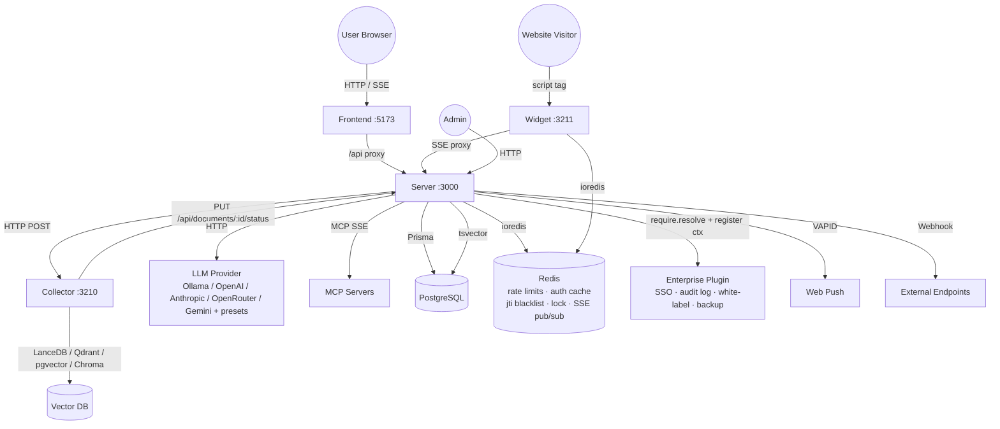

# Architecture

Simmetric Chat is an enterprise-grade, local-first, privacy-first AI chat workspace with RAG (Retrieval-Augmented Generation), RBAC (Role-Based Access Control), and full air-gap capability. The system is designed to run entirely on-premises without external dependencies, while remaining extensible for cloud deployments. Since v1.1, enterprise-only capabilities (SSO, audit log, white-label branding, backup) live in a separate private plugin package (`@simmetric-chat/enterprise`) loaded at boot through a single `require.resolve` seam. Since v1.4 (Phases 161–167), the server's background schedulers run as pg-boss cron jobs with native SKIP LOCKED dedup, API-key verification is keyed-HMAC (single O(1) `findUnique`), and `ENCRYPTION_KEY` is mandatory in production. Since v1.5 (Phases 168–175), the community repo is dual-licensed (AGPL-3.0 community + proprietary commercial enterprise, see `docs/LICENSE_DECISION.md`), and a tag-push release pipeline (`release.yml`) publishes GitHub Releases plus multi-arch (amd64/arm64) Docker images to GHCR. Since v0.22 (Phases 176–179), environment configuration is single-sourced — a shared Zod env schema in `@simmetric-chat/shared` plus `loadRootEnv()` making the repo-root `.env` the effective runtime config — and `rag_search` supports metadata filtering (`documentTypes` + ingest-date range) across both retrieval legs with a server-side correctness backstop.

## Design Principles

- **Local-first**: All compute — embedding generation, vector search, LLM inference — can run locally using Ollama and Xenova/transformers. No external API calls are required for core functionality.
- **Privacy-first**: Documents, chat history, and embeddings never leave the deployment boundary. PII scanning (DLP) is available for air-gap compatible privacy protection.
- **Air-gap compatible**: The system can operate without internet connectivity. All default providers (LanceDB, local embeddings, Ollama) are self-hosted. External providers (OpenAI, Anthropic, OpenRouter, Qdrant) are opt-in. The enterprise package is delivered as a tarball — no `npm install`, no phone-home, no telemetry.
- **Unidirectional dependencies**: The monorepo enforces a strict dependency graph where `shared` is the only cross-package import. Server and collector never import from each other; they communicate via HTTP APIs. The enterprise package imports ONLY `@simmetric-chat/shared`; the community repo imports nothing from enterprise (the loader's `require.resolve` is the only seam).
- **Graceful degradation**: Every optional infrastructure dependency (Redis, external vector stores, external LLM providers) falls back to a single-instance or in-process equivalent when unavailable — the platform never refuses to start because an optional service is down. An absent enterprise package degrades to community mode (info-level no-op); a broken enterprise install fails LOUD (`process.exit(1)` — never silently degrade a paying customer).

## System Overview

At the highest level, Simmetric Chat is a layered architecture:

1. **Frontend** — React 19 SPA served by Vite (dev) or Nginx (production). Communicates with the server via HTTP and SSE (Server-Sent Events).
2. **Server** — Express 5 API (port 3000). Handles auth, RBAC, agent orchestration, chat streaming, document metadata, webhooks, push notifications, MCP tool integration, license gating, the Redis scale layer, the pg-boss job queue (v1.4), and the enterprise plugin seam (`loadEnterprisePlugin` at boot).
3. **Collector** — Express 5 microservice (port 3210). Handles document ingestion: parse, chunk, embed, store. Delegates database mutations back to the server via HTTP callbacks.
4. **Widget** — Express 5 + Preact embeddable chat widget (port 3211). Proxies anonymous visitor chat to the server via SSE.
5. **Shared** — Zero-dependency (except Zod) package containing types, schemas, and constants used by all other packages, including the `PluginContext` contract for the enterprise plugin, the shared env-schema building blocks (`embeddingProviderSchema`/`vectorDbProviderSchema`/`ollamaKeepAliveSchema` — ), and the zero-dependency `loadRootEnv()` root-env loader.
6. **Enterprise plugin** (optional, separate private repo) — SSO (SAML/OIDC/SCIM), immutable audit log, white-label branding, and the backup subsystem, mounted into the server at boot via `register(ctx)`.

The primary data stores are PostgreSQL (structured data, full-text search via tsvector) and a pluggable vector store (LanceDB default, Qdrant, pgvector, or Chroma). Redis is an optional horizontal-scaling layer (rate-limit stores, auth cache, JWT `jti` blacklist, distributed lock, SSE pub/sub fan-out) that activates when `REDIS_URL` is set and degrades gracefully when absent. The system supports multiple LLM providers (Ollama, OpenAI, Anthropic, OpenRouter, Gemini, plus 20 provider presets (DeepSeek, Mistral, Kimi/Moonshot, NVIDIA NIM, OpenAI Codex, OpenCode Go, OpenCode Zen, Qwen, xAI, Z.AI/GLM, Nous Portal, MiniMax, MiniMax China, LM Studio, Gemini native, Xiaomi MiMo, GitHub Copilot, Copilot ACP, Qwen OAuth, xAI Grok OAuth)) with per-chat model selection and graceful fallback.

> **Config model (v0.22)**: the repo-root `.env` is the single runtime config — the zero-dependency `loadRootEnv()` loader (`packages/shared/src/config/loadEnv.ts`), called by server, collector, and widget at boot, merges it under `process.env` with precedence `process.env > root .env > Zod default` (the per-package `.env` override layer was removed after the transition; presence — never truthiness — defines a key; `pnpm-workspace.yaml` is the repo-root marker and missing marker/file are graceful no-ops, so Tauri's packaged layout skips the root merge). The root `.env.example` is the single exhaustive template, regenerated from the Zod schemas with Jest tripwires that fail when a schema key goes undocumented, and organized in per-package sections with `[server]`/`[collector]`/`[widget]` applicability markers.

## Monorepo Structure

```text
packages/
shared/ ← Types, Zod schemas, constants, plugin contract (only depends on zod)
server/ ← Express API, Prisma, agent orchestration, enterprise loader (imports shared)
collector/ ← Document ingestion microservice (imports shared)
frontend/ ← React 19 SPA (imports shared)
widget/ ← Embeddable chat widget service (imports shared)

simmetric-enterprise/ ← SEPARATE private repo (not part of this monorepo)
← loaded via require.resolve("@simmetric-chat/enterprise")
```

### Package Dependency Graph

```text
shared
|
+------+------+------+------+
| | | |
server collector frontend widget
|
| require.resolve (only seam)
v
@simmetric-chat/enterprise (optional, separate repo)
```

**Strict modularity** is enforced at build time: `server` and `collector` never import from each other. All cross-service communication is via HTTP. `shared` is the only package that may be imported by multiple consumers. The enterprise package imports ONLY `@simmetric-chat/shared`; core-owned capabilities (auth, crypto) are delegated to it via `ctx.generateToken`, `ctx.encrypt`, `ctx.decrypt`.

### Turborepo Pipeline

The monorepo uses `turbo` for task orchestration with `dependsOn: ["^build"]` for build, lint, typecheck, and test tasks. Key pipelines:

- `pnpm dev` — Starts all services concurrently (server :3000, frontend :5173, collector :3210, widget :3211)
- `pnpm build` — Builds all packages in dependency order
- `pnpm test` — Runs Jest suites across all packages
- `pnpm db:generate` — Regenerates Prisma client (directory mode — merges `schema.prisma` + `schema-enterprise.prisma`)
- `pnpm license:check` — Verifies the configured license without starting the server (exit 0/1/2)
- `pnpm license:check-self` — Verifies the repo's own license files (project-self license + stale-Apache grep gate, v1.5 )
- `pnpm version:check` / `pnpm version:bump` — Version-stamp sync (package.json ↔ latest git tag, major.minor compare; v1.5 ); root package.json tracks the latest 0.x tag since the pre-1.0 renumbering
- `pnpm changelog:check` — CI gate: `[Unreleased]` non-empty + Keep-a-Changelog 1.1.0 format validation (v1.5 )
- `rawEnvReads.test.ts` guard suites (server/collector/widget, ) — Behavioral probes pinning the raw `process.env` reads kept outside the Zod schema (encryption/HMAC keys, HF cache behavior, LOG_LEVEL, test gates); run via the per-package jest suites
- `pnpm i18n:check` — Enforces 8-locale parity (en/it/ru/de/fr/es/zh/pt — pt added 2026-08-26) for frontend AND widget translation namespaces
- `pnpm audit:migrations` — Guards the additive-only Prisma migration policy (CI fails on drift)

## Component Diagram



## Data Flow

### 1. Chat Flow (Frontend)

1. User sends a message in the frontend chat panel.
2. Frontend opens an SSE connection to `POST /api/workspaces/:id/chat/stream`.
3. Server `authMiddleware` validates the JWT Bearer token (and checks the Redis `jti` blacklist when the token carries a `jti`).
4. Server `requireWorkspaceAccess` verifies the user owns or has access to the workspace (IDOR prevention).
5. Agent orchestrator (`packages/server/src/agent/orchestrator.ts`) resolves the model configuration:
- Per-chat override → Workspace default → Global default → Environment variables.
6. The ReAct loop decides whether to invoke skills (RAG search, workspace memory, document temp process, MCP tools, wiki query/write, web search). Cloud LLMs occasionally emit implicit tool calls as raw `<search><query>…</search></query>` XML; `toolCallResolver` + `implicitToolCall` map these tags to a registered skill so the loop never stalls on unstructured output.
7. LLM response is streamed token-by-token via SSE events: `token`, `status`, `citations`, `done`, `error`, plus additive `thinking` (emitted only when the client opts in via `include_thinking`), `plan` (agent plan banner), and `wiki_edit` (wiki write results). The `done` event carries `messageId`, `chatId`, `model`, `providerType`, `mcpSources`, `resolvedWikilinks`, `tokenUsage`, `dlp_matches`, `pipeline`, and the normalized `doneReason` (per-provider termination reason, additive optional).
8. Frontend appends tokens to the chat UI in real time via `useChatStreaming` (`packages/frontend/src/hooks/useChatStreaming.ts`, `fetchEventSource` + SSE event handlers).
9. **Multi-instance fan-out (v0.16/v0.19)**: each streamed event is written to the local client first, then fire-and-forget published to the Redis pub/sub channel `sse:chat:{chatId}` (`publishSSEEvent` in `packages/server/src/routes/chat.ts`). Non-originating instances relay events from a `redis.duplicate()` subscriber; an `originatingChats` set prevents double-write on the originating instance. Without Redis, streaming stays single-instance.

### 2. Document Ingestion Flow

1. User uploads a document via the frontend (unified upload pipeline writes an `UploadDraft` first; server stages and assigns it before handing off to the collector).
2. Server receives the multipart upload (multer, 100 MB limit) and creates a `Document` record with status `pending`.
3. Server forwards the file to the collector via `POST /api/ingest` (guarded by `requireCollectorSecret`, `X-Collector-Secret` header).
4. Collector parses the file (PDF, DOCX, XLSX, PPTX, TXT, MD, CSV, YouTube URL, or OCR fallback).
5. Collector chunks text using `RecursiveCharacterTextSplitter` (default 1000 chars, 200 overlap).
6. Collector generates embeddings via the configured provider: `LocalEmbeddingProvider` (Xenova/transformers 2.x, default), `OpenAIEmbeddingProvider`, `OllamaEmbeddingProvider`, or the HF provider `HuggingFaceLocalEmbeddingProvider` behind `EMBEDDING_PROVIDER=hf-local` (backed by `@huggingface/transformers` v4 since ; same model IDs/dimensions as the Xenova provider, so switching local→hf-local does not require re-indexing; air-gap via `HF_CACHE_DIR`).
7. Collector stores vectors in LanceDB (workspace-scoped tables), Qdrant (collection named `ws_{sanitizedName}_{shortUuid}` — sanitized workspace name plus 8-char UUID suffix; falls back to `ws_{uuid}` when only the ID is known), pgvector, or Chroma.
8. Collector notifies the server via `PUT /api/documents/:id/status` with `status: "completed"` or `"failed"`. The server then flips `vectorCleanupAt` once the collector confirms the vector purge.

### 3. RAG Search Flow

1. User sends a chat message that triggers the `rag_search` skill.
2. The agent orchestrator calls `hybridSearch(query, workspaceId, limit)` (or `hybridSearchWithRerank` when the reranker is enabled), optionally passing a `filters` object (`documentTypes` — the 6-value pdf/md/txt/csv/docx/xlsx enum — plus `dateFrom`/`dateTo` ISO dates; "filterable RAG" fix). The LLM supplies filters through `rag_search`'s input `metadata` block in `packages/server/src/agent/builtinSkills.ts`, which validates against the shared `RagMetadataFilterSchema` and returns a descriptive tool error on invalid filters so the model can self-correct.
3. The server normalizes filters once (`normalizeInputFilters` — date-only upper bounds become inclusive end-of-day UTC, plus epoch-ms mirrors for Qdrant) and runs two searches in parallel:
- **Vector search**: HTTP POST to collector `/api/ingest/query` carrying the optional `filters` key (validated by `IngestQueryRequestSchema` in `packages/shared/src/schemas/ingest.schema.ts`). The collector merges them into the provider filter object — `workspaceId` stays mandatory (filters may only narrow, never widen scoping). Providers pre-filter when supported: pgvector uses parameterized JSONB predicates on the stamped `metadata->>'documentType'` / `metadata->>'documentCreatedAt'` columns (`packages/collector/src/services/pgVectorProvider.ts`); Qdrant builds `match.any` + numeric-range `must` clauses (`packages/collector/src/services/vectorStore.ts`); LanceDB and Chroma do not support the keys and degrade-with-strip — a logged warn plus reliance on the server-side backstop.
- **Full-text search**: PostgreSQL `tsquery` on `document_chunks.searchVector` (legacy) or `document_chunks.searchVectorMulti` (, multi-locale Snowball configs: it/ru/de/es/fr + `simple` for zh) with a GIN index (`ftsService.ts`; the query is sanitized against `to_tsquery` metacharacters so hyphens/phrases degrade to safe conjunctions instead of syntax errors). With filters active, parameterized SQL predicates join the documents table (`d."type"::text = ANY(...)`, `d."createdAt"` range — `packages/server/src/services/ftsService.ts`). The `searchVectorMulti` column is backfilled boot-synchronously (`searchVectorMultiBackfill.ts`); `searchVector` is retained for zero-recall-degradation cutover.
4. Results are merged via **Reciprocal Rank Fusion (RRF, k=60)**, normalized per-workspace so a workspace with more chunks cannot dominate fused ordering; `multiWorkspaceHybridSearch` performs a second-pass RRF fusion across workspaces with a deterministic tiebreaker. An optional CrossEncoder reranking stage (collector endpoint, top-k only) refines results above RRF.
5. **Correctness backstop**: whenever filters are active (and the workspace is not an `archive:*` pseudo-workspace), `applyMetadataBackstop` re-verifies every result's `documentId` against the authoritative documents table with the SAME predicates (`prisma.document.findMany` in `packages/server/src/services/hybridSearchService.ts`), dropping misses — pure `fts` results already carry the SQL predicates and bypass the gate; on backstop error the gate fails OPEN with a warn. Legacy vectors predating ingest-time stamping are excluded by pre-filter providers, caught by the backstop on strip-degrade providers, and regain filterability via admin re-embed.
6. Filterability is stamped at ingest: the collector writes `documentType` / `documentCreatedAt` / `documentCreatedAtMs` into every chunk's `VectorMetadata` (`packages/collector/src/routes/ingest.ts`; the reembed route re-stamps from the Document row).
7. Merged results are injected into the LLM system prompt with `SourceCitation` metadata (canonical type lives in `@simmetric-chat/shared`; producers for RAG, archive, tool results, web search, and memory all populate the additive `source` widening). After dedup, a **grounding filter** (, `packages/server/src/agent/citationDedup.ts`) caps per-document chunk citations at the top-2 by relevance and drops chunk citations with no meaningful lexical overlap with the final answer — citations reflect what the answer actually grounds on.
8. Archive pages (`Chat.archiveId`) participate as a RAG fallback when a chat is bound to an archive (the archive fallback call keeps its 3-arg form — never narrowed by workspace filters). Per-user memories (`memory_search` skill, `Memory` model) can inject prior extracted knowledge into context.

### 4. Widget Embed Flow

1. External website includes `<script src="https://server/widget/:id.js">`.
2. Widget loader creates a sandboxed iframe and loads the Preact IIFE bundle. The iframe is sandboxed **without** `allow-same-origin`, so it cannot read its own `sessionStorage`; instead it performs a parent-page handshake: the loader stores the anonymous session token and message history in the **parent page's** `sessionStorage` under `sc-widget-${widgetId}-session` and `sc-widget-${widgetId}-messages`, exchanged via `postMessage` (`simmetric:storage-get` / `simmetric:storage-set`). The iframe validates replies with `event.source === window.parent` (origin comparison is impossible from an opaque origin).
3. Preact app creates an anonymous session (`POST /api/sessions` → server internal widget API `POST /api/internal/widget/session`); a cached valid token from the handshake avoids re-creating sessions on every load. The loader fetches the widget config from the widget service's `GET /api/config/:widgetId` (Redis + 5-min in-memory cache keyed per widgetId), which proxies the server's internal `GET /api/internal/widget/:id/config`.
4. Visitor sends a message → widget proxies SSE to the server's workspace chat endpoint (`POST /:widgetId/stream`), stripping `thinking` events and enforcing per-widget rate limits. If the server-side RAG query fails or returns nothing, the widget emits a `status: rag-degraded` SSE event to the client and disables `ragSearch` upstream (WID-02).
5. Widget RAG scope is limited to whitelisted workspaces via the `WidgetWorkspace` join table; the widget service sends only the `widgetId` upstream and the server resolves `workspaceIds` from the DB whitelist (IDOR prevention). The internal config response also carries raw `localizedTexts`, `suggestedQuestions`, `credits`, and `fallbackLocale` blobs (visitor-agnostic, not locale-resolved) plus the full `workspaceIds` array — the shared `widgetConfigResponseSchema` is the typed contract for the widget service's `getWidgetConfig`.

## Key Architectural Patterns

### ReAct Agent Orchestration

The agent loop (`packages/server/src/agent/orchestrator.ts`) implements a Reason + Act pattern:

1. Receives a user message and chat history.
2. Resolves available skills (built-in registry + MCP tools pinned to the chat). Built-in skills registered on module import in `packages/server/src/agent/builtinSkills.ts`: `rag_search`, `workspace_memory`, `document_temp_process`, `wiki_query`, `wiki_write`, `web_search` (always-ON in Community since v1.1 — the `web_search` feature flag was removed).
3. Streams the LLM response; if the LLM emits a tool call (or implicit `<tag>`-wrapped tool call that `toolCallResolver`/`implicitToolCall` recognizes), the orchestrator pauses streaming, executes the skill, and feeds the result back into the context.
4. Repeats until a final answer is reached or the agent budget tracker (`packages/server/src/services/agentBudgetService.ts`) exhausts the configured budget (per-user concurrency cap, per-request token budget, wallclock timeout).
5. All skills are sandboxed — only registered skills can be invoked. No arbitrary code execution is possible.

### RBAC with IDOR Prevention

- **Permission model**: 31 permission names (e.g., `workspace:read`, `chat:write`, `admin:settings`, `backup:destination:read`, plus `memory:read`/`memory:write` for per-user memories and `filters:manage` for the DLP/filter plugin admin) stored in a `Permission` table, linked to roles via `RolePermission`. Defined in `packages/shared/src/constants/permissions.ts`. The `user` role is read/write on its own memories; `filters:manage` is admin-only.
- **Menu sections**: 13 sidebar sections (`dashboard`, `chat`, `documents`, `knowledgeBase`, `workspaces`, `projects`, `marketplace`, `mcpConnections`, `eventLog`, `analytics`, `widget`, `settings`, `uploads`) controlled per role via `RoleMenuSection`.
- **Middleware chain**: `authMiddleware` → `requireWorkspaceAccess` / `requireProjectAccess` → `requirePermission` → `requireFeature` / `requireFeatureLimit` → `uploadGate` (gates draft-to-document promotion).
- **IDOR prevention**: Access checks are performed at the database query level, not just route level. Every query includes ownership or access-grant filters.

### License-Based Feature Gating

- License is an RS256 JWT verified with a public key embedded in the source, loaded at startup via `LICENSE_KEY`.
- **11 feature flags** (v1.1 trimmed from 20): boolean features (`sso_enabled`, `audit_log_immutable`, `white_label`, `widget_enabled`, `backup_enabled`, `widget_credits_editing`) and numeric limits (`max_workspaces`, `max_projects`, `custom_agents`, `max_widgets`, `max_backup_destinations`). Defined in `packages/shared/src/constants/license.ts`. The 8 commodity features (web_search, webhooks, push_notifications, memory_enabled, lead_export, widget_analytics, auto_title_enabled, synthesis_rate_limit) are now always-ON in Community builds; `priority_support` moved to a commercial/SLA contract. A v1.0 JWT carrying a removed flag still parses (additive-only invariant) — removed keys are silently dropped by the override loop.
- **Shared verifier (v0.19)**: `verifyLicenseKey()` (exported from `packages/server/src/services/licenseService.ts`) returns a discriminated `LicenseVerifyResult` with a closed `LicenseVerifyReason` enum (`missing | expired | bad-signature | malformed | schema-mismatch`); `initLicense()` delegates to it and emits message-first winston logs (info on loaded/missing, warn on expired/bad-signature) with no key/secret/JWT-body in any log meta.
- **Diagnostics (v0.19)**: admin-only `GET /api/license/diagnose` (`packages/server/src/routes/license.ts`) reports tier, licensee, expiry, verification reason, env presence, and resolved `ENV_PATH` — with a route-local `redactSecret()` guarantee; `pnpm license:check` (`packages/server/scripts/check-license.ts`) reuses the same verifier and exits 0 (valid/Community-entitled), 1 (token doesn't entitle), or 2 (env/config error).
- **Enterprise overrides (v1.1 )**: the enterprise plugin raises numeric limits at boot via `ctx.overrideFeatureLimit` (forwards to `licenseService.setLimitOverride`). Reactive revocation: `clearLimitOverrides()` runs at the START of `initLicense()` and in `getLicenseInfo()`'s runtime-expiry branch, so a Community JWT loaded after an Enterprise one cannot inherit `Infinity` overrides.
- **Graceful degradation**: If an Enterprise license expires at runtime, the system automatically reverts to Community tier without restart.
- Middleware: `requireFeature(flag)` returns 402 for disabled features; `requireFeatureLimit(flag, model)` returns 402 with `limit` and `current` for exceeded quotas.

### Enterprise Plugin Architecture (v1.1)

The enterprise package (`@simmetric-chat/enterprise`) is a separate private repo — IP isolation, air-gap tarball delivery, single-package contract. See [ENTERPRISE_PLUGIN.md](ENTERPRISE_PLUGIN.md) for the full contract and air-gap install runbook.

- **Loader seam**: `packages/server/src/services/enterpriseLoader.ts` — two-step `require.resolve("@simmetric-chat/enterprise")` → `require(resolvedPath)`. `MODULE_NOT_FOUND` → community mode (info-level no-op). Any other resolve/load/register error → `process.exit(1)` (fail-loud, never fail-open). Runtime `apiVersion` check (`API_VERSION = 1` in shared) — mismatch → `process.exit(1)`.
- **Boot order**: `prisma.$connect()` → `initLicense()` (validates JWT, builds `tierFeatures`) → `loadEnterprisePlugin(app)` (calls `register(ctx)` which mounts routes, registers schedulers, calls `overrideFeatureLimit`) → routes live. Enforced by `packages/server/src/__tests__/bootOrder.test.ts`.
- **PluginContext contract** (`packages/shared/src/schemas/plugin.schema.ts`): `app`, `prisma` (singleton, never `new PrismaClient()`), `logger`, `env`, `licenseInfo`, `mountProtected(path?, router)` (applies community `authMiddleware` — core owns auth, plugin owns the handler; missing `Authorization` → 401), `mountPublic(path?, router)` (no auth — IdP-initiated SAML/OIDC callbacks + SCIM with its own Bearer token), `registerScheduler(name, {start, stop})` (start at boot, stop during graceful shutdown, 5s per-teardown cap), `onShutdown(fn)`, `registerAuditLogWriter(fn)` (IoC — injects the enterprise audit writer into the community `logEvent()` shim via `setAuditLogDelegate`), `registerConfigKeyValidator(fn)` (branding validator rejects non-Enterprise `BRANDING_*` keys in `updateSettings()` — the ctx method aliases the community `systemConfigService.registerConfigKeyValidator` to avoid the recursive self-call pitfall), `auditLog`, `overrideFeatureLimit(flag, value)` (same alias pattern — `setLimitOverride` in `licenseService.ts`), `generateToken(userId)`, `encrypt(plaintext)` / `decrypt(ciphertext)` (AES-256-GCM, core-owned crypto delegated).
- **Known enterprise-side pitfall (v0.22, documented)**: when `@simmetric-chat/shared` gains NEW source files, an out-of-date enterprise `file:` dependency snapshot can crash the server at boot with "Cannot find module './env.schema'" — pnpm's `file:` snapshot only hardlinks already-existing files, so `schemas/index.js` may require a module that never reached the snapshot, and the fail-loud policy turns this into a boot crash loop. Remedy (air-gap runbook in `docs/ENTERPRISE_PLUGIN.md`): refresh the snapshot with `pnpm install`, THEN `pnpm build` — reinstall is not rebuild.
- **Extracted subsystems**: SSO (SAML + OIDC + SCIM 2.0, ), audit log (immutable `event_logs` + INSERT-only DB role `simmetric_audit_writer`, ), white-label branding, backup (destinations + Bree scheduler + local/S3 providers, ).
- **Community removals**: `@mintplex-labs/bree`, `nodemailer`, `openid-client`, `@node-saml/node-saml`, `@node-saml/passport-saml`, `passport`, `yauzl` were removed from the community server dependencies (moved to the enterprise package).

### Hybrid RAG with Reciprocal Rank Fusion

- **Vector search**: Semantic similarity via LanceDB (local, default), Qdrant, pgvector, or Chroma.
- **Full-text search**: PostgreSQL `tsvector` on `document_chunks.searchVector` with a GIN index; `ftsService.ts` sanitizes the query against `to_tsquery` metacharacters before ranking with `ts_rank`. When RAG metadata filters are active, parameterized SQL predicates on the documents table (type IN-list + createdAt range) join the query.
- **Fusion**: RRF merges ranked lists from both engines with `score = sum(1 / (60 + rank))`. Per-workspace normalization prevents a workspace with more chunks from dominating fused ordering; `multiWorkspaceHybridSearch` performs a second-pass RRF fusion across workspaces with a deterministic tiebreaker.
- **Metadata filters (260830-ur9, v0.22)**: optional `documentTypes` + `dateFrom`/`dateTo` filters thread from the `rag_search` skill through `hybridSearch`/`multiWorkspaceHybridSearch` into both legs. Provider support is tiered: pgvector (JSONB predicates on ingest-stamped metadata) and Qdrant (`match.any` + numeric range) pre-filter; LanceDB and Chroma degrade-with-strip; a `prisma.document.findMany` backstop (`applyMetadataBackstop` in `packages/server/src/services/hybridSearchService.ts`) re-checks result documents against the authoritative table so filtered correctness holds on every provider.
- **Reranking**: optional CrossEncoder stage above RRF (collector `/api/ingest/rerank` endpoint, top-k only) — server-side `rerankCandidates` in `packages/server/src/services/rerankService.ts` calls the collector's HTTP endpoint `/api/ingest/rerank`, gated by the `rag_reranker_enabled` SystemConfig key (default off).
- Results are tagged as `vector`, `fts`, or `both` for transparency.

### Redis Scale Layer

All Redis interaction in the server goes through the lazy singleton `getRedis()` (`packages/server/src/services/redisService.ts`); the widget service mirrors the pattern (`packages/widget/src/services/redisService.ts`). When `REDIS_URL` is absent, `getRedis()` returns `null` and every consumer degrades to single-instance behavior. Consumers (all with `[redis]`-prefixed, non-blocking error handling):

- **Rate-limit stores (v0.19 TEC-03a)**: `packages/server/src/middleware/rateLimit.ts` attaches a `rate-limit-redis` store on the shared connection when Redis is available, with per-limiter key prefixes (`rl:auth:`, `rl:api:`, `rl:lead:`); `express-rate-limit` falls back to its in-process `MemoryStore` otherwise. The widget service uses a shared `rl:`-prefixed store for its chat/session/lead limiters.
- **Auth cache (v0.16 SCALE-01)**: `getCachedUserWithRoles` in `packages/server/src/services/authService.ts` caches user+roles under `auth:user:{userId}` with TTL; invalidation on role/permission changes.
- **JWT `jti` blacklist (v0.19 TEC-03b)**: `packages/server/src/services/tokenRevocation.ts` — `rev:jti:{jti}` key presence check (SET + TTL, default 86400s = `SESSION_EXPIRY`). `generateToken` mints `jti: crypto.randomUUID()`; `authMiddleware` rejects any token whose `jti` is blacklisted. Tokens without `jti` (pre-deploy) still verify.
- **Distributed lock (v0.16 SCALE-03, hardened v0.19 TEC-03d)**: `packages/server/src/services/distributedLock.ts` wraps job bodies with `redlock` (`retryCount: 0`, skip-on-busy), a `.unref()`'d heartbeat (`lock.extend(60_000)` every 20s) so long jobs never lose their lock, Lua check-and-delete release, and a PostgreSQL mutex fallback when Redis is absent. added `isResourceLocked()` to correctly map redlock 5.0.0-beta.2's `ExecutionError`-wrapped contention to a null (skip) result. **Since v1.4 the community schedulers no longer use `withDistributedLock`** — pg-boss's native SKIP LOCKED job dedup supersedes both the in-process overlap guard and the distributed lock (one-way door, no fallback timer). The module's 4-function surface (`acquireBackupMutex`/`releaseBackupMutex`/`acquireRedisLock`/`releaseRedisLock`) is retained for the enterprise backup subsystem's byte-compatible contract; no community scheduler imports it.
- **SSE pub/sub fan-out (v0.16 SCALE-02, proven cross-instance v0.19/v1.4)**: see Data Flow §1. The relay helpers were extracted as `publishSSEEvent` + `setupSSESubscriber` (exported from `packages/server/src/routes/chat.ts`) and are exercised by a two-instance cross-instance relay test (`sseFanout.test.ts`, — closes the deferral).

Multi-instance behavior is verified by `pnpm --filter server smoke:multi-instance` (two live instances sharing Redis: cross-instance `jti` revocation → 401, shared lead bucket → 429 on the 31st request, single-executor distributed lock).

### pg-boss Job Queue (v1.4, Phases 164–165)

Since v1.4 the server's background schedulers run as pg-boss cron jobs instead of in-process `setInterval` timers. The singleton lives in `packages/server/src/services/jobQueue.ts` (`pg-boss` ^12.28.0):

- **Own connection pool**: pg-boss receives `DATABASE_URL` directly and manages its own `pg.Pool` (default `max: 10`) — it never touches the Prisma driver-adapter pool, so the two never share connection-accounting state .
- **Own schema**: pg-boss uses its default `pgboss` schema; `start()` auto-creates + auto-migrates it. This is NOT a Prisma migration and does not affect `pnpm audit:migrations` .
- **Graceful degradation **: `startJobQueue()` never throws and never calls `process.exit` — if Postgres is unreachable it logs at `error`, leaves `bossInstance = null`, and the server continues booting (REST/SSE unaffected). `getBoss() === null` is the degradation contract: each scheduler init logs a warn and returns early with **no fallback timer** (D-02 one-way door).
- **Idempotent lifecycle**: `startJobQueue()` is guarded by an `initAttempted` flag; `stopJobQueue()` is null-safe and resets the instance so a second call is a no-op.
- **Delegators**: `createQueue(name)` MUST precede `schedule(name, cron)` (a schedule references a queue by name — foreign-key constraint); both throw when the queue is unavailable. `boss.work` handlers receive a `Job[]` array (iterate with `for...of`) and must log + resolve rather than re-throw (a re-throw triggers a pg-boss retry storm).
- **SKIP LOCKED dedup**: pg-boss's native job dedup supersedes both the old `isRunning` overlap guard and the distributed lock — exactly one instance executes each cron tick across a multi-instance fleet.

**Boot sequence** (enforced by `packages/server/src/__tests__/bootOrder.test.ts`):

1. `prisma.$connect()` (after the production `ENCRYPTION_KEY` gate — see Security Model)
2. `startJobQueue()` — after `prisma.$connect()`, before `loadEnterprisePlugin` and the production scheduler block
3. 8 async scheduler inits, each `createQueue` + `schedule` + `boss.work` (awaited so a registration error surfaces at boot): `initMCPHealthCheckScheduler` (`healthcheck_mcp`, `*/30 * * * *`), `initMCPReaperScheduler` (`reaper_mcp`, `*/5 * * * *`), `initSynthesisReaperScheduler` (`reaper_synthesis`, `*/15 * * * *`), `initFidelitySamplingScheduler` (`fidelity_sampling`, `0 3 * * 0` — stays inline in `index.ts`), `initVectorCleanupScheduler` (`cleanup_vector`, `*/5 * * * *`), `initUploadDraftReaperScheduler` (`reaper_upload-draft`, `0 3 * * *` — cron-configurable via `upload_draft_reaper_cron`, disabled when `upload_draft_reaper_enabled` is falsy), `initChatMessageReaperScheduler` (`reaper_chat-message`, `0 3 * * *`), `initWikiConsistencyScheduler` (`consistency_archive`, `0 * * * *`)
4. `loadEnterprisePlugin(app)` → `mountCatchAlls(app)` → `app.listen`

**Graceful shutdown** (raced against a 5s hard timeout): `shutdownMCPConnections()` → `stopJobQueue()` (drains in-flight jobs with `{ graceful: true, timeout: 4500 }` — the 4.5s cap leaves a 500ms buffer for the rest of the race) → `shutdownEnterprisePlugin()` → `prisma.$disconnect()`. The 7 per-scheduler shutdown calls were removed — pg-boss drains all workers across the cron queues.

**Not migrated (v1.4 deferral)**: the two 10s pollers — OCR/URL pipeline (`initOcrPipelineScheduler`) and synthesis pipeline (`initSynthesisPipelineScheduler`) — stay as `setInterval` with `isRunning` guards in `index.ts` (cron cannot express sub-minute cadences). They run in both dev and production.

### Strategy Patterns

| Pattern | Interface | Implementations | Location |
|---------|-----------|-----------------|----------|
| Embedding | `EmbeddingProvider` | `LocalEmbeddingProvider` (Xenova 2.x, default), `OpenAIEmbeddingProvider`, `OllamaEmbeddingProvider`, `HuggingFaceLocalEmbeddingProvider` (HF v4 behind `EMBEDDING_PROVIDER=hf-local`) | `packages/collector/src/services/embeddings.ts` |
| Vector Store | `VectorStoreProvider` | `LanceDBProvider` (default), `QdrantProvider` (raw HTTP via axios), `PgVectorProvider`, `ChromaProvider` | `packages/collector/src/services/vectorStore.ts`, `packages/collector/src/services/pgVectorProvider.ts` |
| LLM Streaming | `streamLLM` | Ollama, OpenAI, Anthropic, OpenRouter, Gemini + OpenAI-compatible | `packages/server/src/agent/llmStreaming.ts` |
| Provider Resolution | `resolveProviderConfig` | Per-chat → Workspace → Global → Env | `packages/server/src/services/providerService.ts` |
| Tool-Call Resolution | `toolCallResolver` + `implicitToolCall` | Explicit JSON tool calls + cloud `<tag>`-wrapped implicit tool calls | `packages/server/src/agent/toolCallResolver.ts`, `packages/server/src/agent/implicitToolCall.ts` |
| Model Fallback | `modelFallback` | Auto-fallback on SSE error when persisted chat model is invalid/unavailable | `packages/server/src/agent/modelFallback.ts` |
| SystemConfig Resolution | `systemConfigService` | `ALWAYS_READONLY` keys (JWT_SECRET, DATABASE_URL, SERVER_PORT, COLLECTOR_PORT, SERVER_URL, COLLECTOR_URL) are ENV-only — never DB, never cached; all other UI-editable keys resolve DB > ENV > Default (UI edits take effect immediately; 8-case matrix test-pinned). Non-readonly keys with an env value present-but-losing-to-DB carry the `envOverridden` flag on the settings-UI GET path (D-08, ) | `packages/server/src/services/systemConfigService.ts` |
| Shared Env Schema | `embeddingProviderSchema` / `vectorDbProviderSchema` / `ollamaKeepAliveSchema` | Single source for `EMBEDDING_PROVIDER` (local|openai|ollama|hf-local, default `local`), `VECTOR_DB_PROVIDER` (lancedb|qdrant|pgvector|chroma, default `lancedb`), and `OLLAMA_KEEP_ALIVE` (default `10m`); consumed inline by server + collector env Zod objects (`packages/server/src/config/env.ts`, `packages/collector/src/config/env.ts`) — identical enums/defaults, additive widening only | `packages/shared/src/schemas/env.schema.ts` |
| License Verification | `verifyLicenseKey` | Shared verifier used by `initLicense`, `/api/license/diagnose`, and the `license:check` CLI | `packages/server/src/services/licenseService.ts` |
| Reranking | `rerankCandidates` (server) → `CrossEncoderReranker` (collector) | Optional CrossEncoder stage above RRF, gated by `rag_reranker_enabled` (default off); `getReranker()` lazily loads the ONNX Xenova/bge-reranker-base pipeline (v2-m3 rejected, safetensors-only) | `packages/server/src/services/rerankService.ts`, `packages/collector/src/services/reranker.ts` |
| Enterprise Plugin | `EnterprisePlugin.register(ctx)` | `@simmetric-chat/enterprise` (separate repo) loaded via `require.resolve` seam | `packages/server/src/services/enterpriseLoader.ts`, `packages/shared/src/schemas/plugin.schema.ts` |

## Database Schema Overview

PostgreSQL is the primary database. Prisma 7.10.x manages migrations and queries. The Prisma config (`packages/server/prisma.config.ts`) runs in **directory mode** (`schema: "prisma"`): `prisma generate` merges `schema.prisma` + `schema-enterprise.prisma` into ONE client (Prisma 7.9.1 `prismaSchemaFolder` feature, GA — no preview flag). The enterprise fragment holds the SSO, audit-log, and backup models; the generated client always exposes their delegates (even in a pure community build), and the empty-table path is the actual community code path.

### Key Models

| Model | Purpose |
|-------|---------|
| `User` | Accounts with `passwordHash`, roles, project/workspace access |
| `Role` | Named roles with permissions and menu sections |
| `Permission` | Enum-as-table pattern: each row is a permission string |
| `Project` | Top-level containers with soft deletes (`deletedAt`) |
| `Workspace` | Chat and document containers within a project |
| `Chat` / `ChatMessage` | Conversation history with metadata JSON; `Chat.archiveId` links to archive RAG fallback |
| `Document` / `DocumentChunk` | Uploaded files with chunk-level embeddings and `tsvector` (`searchVector` legacy + `searchVectorMulti` multi-locale ); `vectorCleanupAt`/`vectorCleanupFailedAt` track post-delete vector purge |
| `UploadDraft` | Staged uploads awaiting assignment; daily 03:00 reaper soft-deletes expired drafts |
| `Widget` / `WidgetWorkspace` / `WidgetSession` / `WidgetLead` / `WidgetEvent` | Embeddable widget configs, workspace whitelists, anonymous sessions, leads, analytics events |
| `Provider` / `ProviderModel` | LLM provider configs with encrypted API keys |
| `MCPConnection` / `McpCatalogEntry` / `ChatMCPPin` | MCP tool marketplace and per-chat scoping |
| `SystemConfig` | Runtime key-value settings with DB > ENV > Default resolution (UI edit wins; `ALWAYS_READONLY` infra keys are ENV-only) — Redis-cached (`config:` prefix, 5-min TTL, invalidation on update) |
| `ApiKey` | Hashed service-to-service API keys with prefix indexing |
| `Archive` / `ArchivePage` / `ArchiveConfig` / `ArchiveSchemaTemplate` | Multi-page knowledge bases with wikilink support |
| `Memory` | Per-user extracted knowledge (v0.15): `userId`+`workspaceId`+`sourceMessageId`, vector, path — powers `memory_search` and auto-extraction |
| `SynthesisRun` / `SynthesisPreview` | AI synthesis pipeline with preview/approve/reject workflow (`SynthesisPreview` is the shared type inferred from `synthesisPreviewSchema`, whose `changes` array uses `synthesisChangeSchema` — `packages/shared/src/schemas/synthesis.schema.ts`) |
| `OcrJob` / `OcrPageResult` | OCR pipeline for image-based document extraction |
| `WorkspaceAgentConfig` / `AgentSkill` / `WorkspaceTokenUsage` | Per-workspace agent config, skill toggles, token metering |
| `WorkspaceTemplate` / `ArchiveImportJob` / `WikiEditRun` | Industry templates, archive imports, wiki edit runs |
| `Webhook` / `PushSubscription` | Outbound webhooks and VAPID web-push subscriptions (always-ON community features since v1.1) |
| `DlpPattern` | DB-backed DLP pattern registry (v0.22): 10 seeded built-ins (regex frozen) + up to 50 admin-defined custom patterns per instance; 5-minute in-memory TTL cache |
| `SsoConfig` / `IdentityProvider` / `ScimGroup` | **Enterprise-owned** (schema-enterprise.prisma): SAML/OIDC config, IdP links, SCIM 2.0 groups |
| `EventLog` | **Enterprise-owned** (schema-enterprise.prisma): immutable audit events; INSERT-only DB role `simmetric_audit_writer` enforces immutability at the privilege level |
| `BackupDestination` / `BackupJob` / `BackupLog` | **Enterprise-owned** (schema-enterprise.prisma): backup destinations, scheduled jobs, execution logs |

### Widget Localization (v0.20)

Per-widget localization and credits were added in v0.20 (Phases 125–126). The `Widget` model carries four fields: `localizedTexts`, `suggestedQuestions`, `credits` (all `Json?`, validated by fixed-key-set Zod blob schemas in `packages/shared/src/schemas/widget.schema.ts`, unknown keys rejected) and `fallbackLocale` (default `"en"`). `WIDGET_LOCALES` in shared lists all 8 locales (en/de/es/fr/it/ru/zh/pt); `resolveWidgetTexts` / `resolveSuggestedQuestions` implement the visitor → widget default → en fallback chain with tri-state semantics (null / empty / list). Routes translate `null` to `Prisma.DbNull` via `toJsonWriteValue` in `packages/server/src/routes/widgets.ts`. The internal config response emits the blobs raw (visitor-agnostic, so the Redis/mem config cache is not fragmented per locale); the widget service consumes them through the shared `WidgetConfigResponse` type.

### Soft Deletes

All major entities use `deletedAt: DateTime?` instead of hard deletes. Queries universally filter with `where: { deletedAt: null }`. Use `withSoftDelete()` from `packages/server/src/utils/prisma.ts` to auto-add the `deletedAt: null` filter.

### Full-Text Search

- `DocumentChunk.searchVector` is a PostgreSQL `tsvector` column with a GIN index (legacy, `english` config).
- `DocumentChunk.searchVectorMulti` is a multi-locale `tsvector` column using locale-specific Snowball configs (it/ru/de/es/fr) + `simple` for zh; backfilled boot-synchronously, `searchVector` retained for zero-recall-degradation cutover.
- `pg_trgm` extension is used for trigram similarity fallback.
- FTS is initialized at server startup via `ftsService.ts`. When RAG metadata filters are active, parameterized predicate fragments (`Prisma.sql` — type IN-list, timestamp range) are appended; absent/empty filters produce the exact same SQL template as before.

## Background Jobs and Reapers

Server startup wires the schedulers in `packages/server/src/index.ts`. Since v1.4 (Phases 164–165), the 8 production schedulers are **pg-boss cron jobs** (see [pg-boss Job Queue](#pg-boss-job-queue-v14-phases-164165)) — each registers `createQueue` + `schedule` + `boss.work` at boot, and pg-boss's native SKIP LOCKED dedup replaces the former `isRunning` overlap guards and the distributed-lock wraps. When pg-boss is unavailable (`getBoss() === null`), each init logs a warn and goes offline — no fallback timer. The enterprise backup scheduler (Bree) is owned by the enterprise plugin and registered via `ctx.registerScheduler`:

| Scheduler | Queue / Cadence | Purpose |
|-----------|-----------------|---------|
| MCP health check | `healthcheck_mcp` — `*/30 * * * *` | Lightweight SSE-reachability ping (`pingMCPServer` — explicitly does NOT call `listTools`); three-tier healthy → stale → down transitions |
| MCP reaper | `reaper_mcp` — `*/5 * * * *` | Disconnects unreachable MCP servers |
| Synthesis reaper | `reaper_synthesis` — `*/15 * * * *` | Flips orphaned `PROCESSING` synthesis runs to `FAILED` |
| Vector cleanup | `cleanup_vector` — `*/5 * * * *` | Purges vectors for soft-deleted documents; flips `vectorCleanupAt` on collector success |
| UploadDraft reaper | `reaper_upload-draft` — `0 3 * * *` (configurable) | Soft-deletes expired drafts, best-effort file unlink; gated by `upload_draft_reaper_enabled` (fail-closed — only the literal `"true"` enables) and re-cadenced via `upload_draft_reaper_cron` (pg-boss validates via cron-parser — an invalid value logs a warn and falls back to the default, never crashing boot; the disabled path best-effort unschedules stale rows). Both knobs resolve through the standard `DB > ENV > Default` system settings |
| ChatMessage retention reaper | `reaper_chat-message` — `0 3 * * *` | Two-pass soft/hard purge with 7-day grace |
| Fidelity sampling | `fidelity_sampling` — `0 3 * * 0` | Weekly synthesis fidelity sampling (stays inline in `index.ts`) |
| Wiki consistency | `consistency_archive` — `0 * * * *` | Archive wiki vector consistency checks |
| OCR pipeline scheduler | 10 s `setInterval` | **Not migrated** — schedules pending OCR/URL jobs (runs in dev and production) |
| Synthesis pipeline scheduler | 10 s `setInterval` | **Not migrated** — claims and processes pending synthesis runs (runs in dev and production) |
| Backup scheduler (Bree) | per-job cron | **Enterprise plugin** — multi-job backup pipeline with retention + encryption + distributed mutex (moved to `simmetric-enterprise` in v1.1 ) |

### Chat Retention Reaper

- **Pass 1 (soft-delete)**: Tombstones old messages of active chats only, gated by the `chat_message_retention_days` SystemConfig key (read via `getSetting` in `chatMessageReaperJob.ts`; written only through the dedicated audited route `chatRetention.ts` — `systemConfigService.updateSettings` rejects it). `null`/`""`/non-numeric/`<=0` → Pass 1 is a no-op.
- **Pass 2 (hard-purge)**: Deletes tombstoned rows past a hardcoded 7-day grace. Runs regardless of retention config so a tombstoned row past grace is always purged.
- Surfaces audit metadata `{ softDeleted, hardPurged, retentionDays, graceDays: 7 }`.

## Security Model

### Authentication

- **JWT**: Bearer tokens stored in frontend localStorage. `SESSION_EXPIRY` defaults to 24 hours. Every token mints a `jti` (`crypto.randomUUID()`); revocation is a Redis `rev:jti:{jti}` key presence check (`tokenRevocation.ts`), so a revoked or logged-out token is rejected across **all** server instances sharing Redis. Without Redis, revocation degrades to no-op (single-instance mode). No refresh token mechanism — users re-login after expiry.
- **API Keys (v1.4 )**: `X-Api-Key` header with `sk-` prefix. Verification is a deterministic **HMAC-SHA256** digest of the raw key (signed with the dedicated `API_KEY_HMAC_SECRET`, base64 32-byte, decoupled from `JWT_SECRET`/`ENCRYPTION_KEY` rotation) matched by a single O(1) indexed `findUnique({ key_hash })` — the Postgres unique index is the constant-time compare. The former bcrypt loop (`findMany({prefix})` + `bcrypt.compare`, capped at `take: 10`) is gone. `apiKeyMiddleware` (`packages/server/src/middleware/auth.ts`) is a thin auth-checker that delegates to `validateApiKey` (`packages/server/src/services/apiKeyService.ts`); a missing/invalid `API_KEY_HMAC_SECRET` makes `validateApiKey` throw and the middleware returns **500 (fail-loud), NOT 401** — misconfiguration must not be hidden as "invalid key" (T-163-02 spoofing vector). The 8-hex display prefix (`prefix`, unique-indexed) is derived from the HMAC digest and collision-tolerant since v0.22 ( — fixes the Docker production boot crash-loop on `api_keys.prefix`): `seedWidgetApiKey` (`packages/server/src/services/seedService.ts`) derives the prefix digest-side (deterministic per key+secret pair) and **tolerates** a P2002 on the display prefix (re-checks by `key_hash`; a null re-check = the ~2^-32 digest-prefix collision — warn + skip, never fatal at boot), while `createApiKey` (`packages/server/src/services/apiKeyService.ts`) regenerates a FRESH key per attempt on a prefix collision (bounded 3 attempts, then throws with the delete/rename remediation). See [API_KEY_MIGRATION.md](API_KEY_MIGRATION.md) for the operator migration runbook.
- **Widget Sessions**: 256-bit hex tokens generated server-side, 24-hour expiry, validated on every request.
- **SSO status endpoint**: public `GET /api/auth/sso/status` (no auth middleware) stays in the community — it tells the login page whether SSO is configured and which provider is active (`enabled`, `provider`, `oidcProvider`); the login page renders the SSO button from it (`useSsoStatus` in `packages/frontend/src/queries/useSso.ts`). The endpoint reads the `SsoConfig` table directly (empty-table path is the community code path).
- **SAML / OIDC / SCIM (v1.1)**: The SAML strategy (`validateInResponseTo: always` + 8h `InMemoryCacheProvider` replay protection), the OIDC client (resolved `redirectUri` threaded into `buildAuthorizationUrl`), and SCIM 2.0 provisioning moved to the **enterprise plugin** — mounted via `ctx.mountPublic("/api/auth", ...)` (IdP-initiated callbacks) and `ctx.mountProtected("/api/sso", ...)`, with SCIM at `/scim/v2` applying its own Bearer token. See the SSO verification runbook at `docs/operations/sso-verification-runbook.md`.

### Authorization

- **RBAC**: 31 permissions assigned via roles. The Admin role receives all permissions and all 13 menu sections.
- **IDOR Prevention**: `requireProjectAccess` and `requireWorkspaceAccess` verify the authenticated user is the creator or has an explicit `ProjectAccess` / `WorkspaceAccess` grant.
- **Feature Gates**: Enterprise features return HTTP 402 when the license tier is insufficient.

### Rate Limiting

All limiters are `express-rate-limit` handlers with `standardHeaders`; stores switch to Redis (shared across instances) when `REDIS_URL` is set, in-process otherwise (v0.19 TEC-03a):

- **General API** (`apiRateLimiter`): 200 requests/minute (production) / 2000 (development) per IP, key prefix `rl:api:`. Widget-originated upstream calls are skipped via the `X-Widget-Id` header (the widget service throttles them instead).
- **Auth endpoints** (`authRateLimiter`): 10 requests/minute (production) / 100 (development), prefix `rl:auth:`.
- **Server-side widget session limits** (`internalWidget.ts`): 20 messages/hour per session, 5 conversations/day per session (429 with `retryAfter` when exceeded).
- **Widget service limiters** (keyed per-IP or per-widget, Redis store prefix `rl:`):
- `widgetChatLimiter`: 30 requests/min (prod) per widget, keyed on the `widgetId` parsed from `req.originalUrl` (the previous inbound `X-Api-Key` key never matched the outbound proxy header); `max` is a function reading the per-widget `rateLimitPerMinute` override from the Redis widget config cache (`widget:config:{widgetId}`), falling back to the global default.
- `widgetSessionLimiter`: 50 conversation creations/day per IP (500 in dev).
- `widgetLeadLimiter`: 3 lead submissions/hour per IP.

> Note: The dedicated `chatRateLimiter` (Community 20 / Enterprise 100 per minute) was removed in the Variante A refactor; the ReAct agent enforces its own budget via `AgentBudgetTracker` and the general `apiRateLimiter` remains the coarse safety net.

### Data Protection

- **DLP Filter**: Regex-based PII scanning in agent input/output, master-switched by the `DLP_ENABLED` system config (default on) — the first in-process filter plugin (`packages/server/src/filters/`). Since v0.22 the pattern set is **database-backed** (`DlpPattern` model, `dlp_patterns` table — 10 built-ins seeded idempotently incl. the v0.22 European patterns `it_vat_iva`, `it_codice_fiscale`, `iban`, `eu_phone`; built-in regexes are frozen — modify attempts return 400 — while admins can toggle/rename rows and add up to 50 custom patterns with compile validation, managed in `packages/server/src/services/dlpPatternService.ts` + `packages/server/src/routes/dlpPatterns.ts`). Scans use a 5-minute-TTL in-memory pattern cache with per-pattern compiled-regex caching, falling back to the built-in set when the DB is unreachable; the token-by-token streaming flush keeps the built-in patterns (documented v1 limitation). A `DLP_BYPASS_ROLES` system setting (JSON array of role names, default `[]`) exempts selected roles from ALL scanning/redaction — every bypassed run fires a fire-and-forget `dlp.bypassed` audit event recording WHO bypassed and the origin surface, never the scanned content. Every `dlp.*` event carries `source: "chat" | "widget"` (derived from the widget `X-Widget-Id` header) so the DLP Match History panel can filter by surface. A DLP audit panel and per-message reveal UI let admins inspect flagged content (admin reveal/re-hide conversation-wide toggle added v0.22).
- **API Key Encryption**: Provider API keys and backup destination credentials encrypted at rest using AES-256-GCM.
- **ENCRYPTION_KEY override (two-layer gate, v1.4 )**: A base64-encoded 32-byte `ENCRYPTION_KEY` decouples the data-at-rest encryption key from `JWT_SECRET`. The legacy `scryptSync(JWT_SECRET, salt)` derivation is **disabled in production** — it remains only for dev/test (`NODE_ENV !== "production"`). The gate is two-layer: (1) **boot gate** in `index.ts` — `NODE_ENV === "production" && !ENCRYPTION_KEY` → `logger.error` + `process.exit(1)`, fired BEFORE `prisma.$connect()` so the failure surfaces even if the DB is unreachable; (2) **service gate** in `encryptionService.ts:getEncryptionKey()` — throws when production and unset, defense-in-depth for CLI callers (`rotate-encryption-key`/`verify-encryption-key` run via tsx and bypass `index.ts`). When set, the key is strictly validated (must decode to exactly 32 bytes). `LEGACY_PREVIOUS_ENCRYPTION_KEYS` supports decrypting blobs written under superseded keys. Docker deployments auto-provision a persistent key instead of crash-looping: both `docker/entrypoint.sh` (all-in-one) and `docker/entrypoint-server.sh` source `docker/provision-encryption-key.sh`, which generates the key once into `/app/storage/.encryption-key` (preferring an operator-supplied value, failing loud on a corrupt persisted key) before any Prisma step. See [ENCRYPTION_KEY_ROTATION.md](ENCRYPTION_KEY_ROTATION.md).
- **HTML Sanitization**: `dompurify` sanitizes all markdown-rendered content in frontend and widget.
- **Helmet**: Server uses standard `helmet` 8.3.0 headers. Widget relaxes CSP/frameguard for iframe embedding.

## Technology Stack Per Package

### Server (`packages/server/`)

- **Runtime**: Node.js >=24.0.0, CommonJS module target
- **Framework**: Express 5.2.1
- **ORM**: Prisma 7.10.x (`@prisma/client` + `@prisma/adapter-pg` driver adapter + `@prisma/client-runtime-utils`); directory-mode schema (`prisma/` merges `schema.prisma` + `schema-enterprise.prisma`)
- **Auth**: JWT (`jsonwebtoken` 9.0.3), bcrypt-hashed passwords (`bcryptjs` 3.0.3), API keys (`uuid`-derived `sk-` keys + keyed HMAC-SHA256 `key_hash` since v1.4 ). SAML/OIDC/SCIM moved to the enterprise plugin (v1.1)
- **Redis**: `ioredis` 5.11.1 (singleton with graceful degradation), `rate-limit-redis` 6.0.1 (rate-limit stores), `redlock` 5.0.0-beta.2 (distributed lock — retained for the enterprise backup contract; community schedulers use pg-boss SKIP LOCKED dedup since v1.4)
- **Job queue**: `pg-boss` ^12.28.0 (v1.4 Phases 164–165 — cron schedulers with native SKIP LOCKED dedup, own `pg.Pool` + `pgboss` schema, graceful degradation to `getBoss() === null`)
- **Streaming**: SSE via `axios` 1.19.0 streaming for LLM responses; Redis pub/sub fan-out for multi-instance
- **Push**: `web-push` 3.6.7 for VAPID Web Push (always-ON community feature since v1.1)
- **Logging**: `winston` 3.19.0 with file rotation
- **Docs**: `swagger-jsdoc` 6.3.0 + `swagger-ui-express` 5.0.1 at `/api-docs`
- **MCP**: `@modelcontextprotocol/sdk` 1.30.0
- **LLM abstraction**: `ollama` 0.6.3 (stream/embed/list/vision via the native `ollama` package); text chunking moved to the collector's `@langchain/textsplitters` — the server no longer depends on langchain
- **Wiki graph**: `graphology` 0.26.0 + `graphology-communities-louvain` 2.0.2 ( clean-room TS Graphify reimplementation — Louvain community detection + markdown generation)
- **Validation**: `zod` 4.4.3
- **CLI**: `commander` 15.0.0 (`license:check`, `verify-encryption-key`, `rotate-encryption-key`, migration guards)
- **Test**: `jest` 30.4.2 + `@swc/jest` 0.2.39 (default transform on TypeScript 6) + `supertest` 7.2.2
- **Enterprise seam**: optional peer dependency `@simmetric-chat/enterprise` (loaded via `require.resolve`; absent → community mode, broken → fail-loud)
- **Other**: `pdfjs-dist` 6.2.108, `sharp` 0.35.3, `puppeteer` 25.9.0, `jsdom` 29.1.1, `simple-git` 3.36.0, `gray-matter` 4.0.3, `archiver` 8.0.0, `turndown` 7.2.4, `@mozilla/readability` 0.6.0, `@json2csv/plainjs` 7.0.8, `dompurify` 3.4.14, `markdown-it` 14.3.0, `uuid` 14.0.2, `helmet` 8.3.0, `cors` 2.8.6, `cookie-parser` 1.4.7, `dotenv` 17.4.2, `jsonrepair` 3.15.0, `tsx` 4.23.12, `express-rate-limit` 8.6.2, `multer` 2.2.0, `pg` 8.23.0, `@tavily/core` 0.7.8 (Tavily web search)

### Collector (`packages/collector/`)

- **Runtime**: Node.js >=24.0.0, CommonJS
- **Framework**: Express 5.2.1
- **Chunking**: `@langchain/textsplitters` 1.0.1 (`RecursiveCharacterTextSplitter`) + `@langchain/core` 1.2.9
- **Embeddings**: `@xenova/transformers` 2.17.2 (Xenova 2.x, default `EMBEDDING_PROVIDER=local`), OpenAI API, Ollama embeddings, or the HF provider `EMBEDDING_PROVIDER=hf-local` backed by `@huggingface/transformers` ^4.2.0 (same model IDs/dimensions as Xenova — no re-index when switching; air-gap via `HF_CACHE_DIR`)
- **Vector Store**: `@lancedb/lancedb` 0.31.0 (local, default) or Qdrant (enterprise) or Chroma (`chromadb` 3.5.0, self-hosted, shares `VECTOR_DB_URL`); pgvector via raw `pg` 8.23.0 + `pgvector` 0.3.0 (creates its own `pg.Pool` and queries Postgres directly). RAG metadata-filter support is tiered: pgvector (JSONB predicates on `metadata->>'documentType'`/`metadata->>'documentCreatedAt'`) and Qdrant (`match.any` + numeric range on `documentCreatedAtMs`) pre-filter; LanceDB and Chroma ignore the filter keys with a logged warn (server-side backstop enforces correctness)
- **Ingest metadata stamping**: every chunk is stamped with `documentType` (from the parsed `docType` form field), `documentCreatedAt` (full UTC ISO string), and `documentCreatedAtMs` for filterable RAG (`packages/collector/src/routes/ingest.ts`)
- **Parsing**: `pdf-parse` 1.1.1, `mammoth` 1.12.1, `officeparser` 7.8.0, `xlsx` 0.18.5, `youtube-transcript-plus` 2.0.1
- **Reranking**: CrossEncoder stage above RRF (`seed:reranker` script, RERANKER_MODEL default `Xenova/bge-reranker-base` — v2-m3 explicitly rejected, safetensors-only — via HF v4 pipeline in `reranker.ts`)
- **File uploads**: `multer` 2.2.0 with 100 MB limit
- **Validation**: `zod` 4.4.3
- **Test**: `jest` 30.4.2 + `@swc/jest` 0.2.39

### Frontend (`packages/frontend/`)

- **Runtime**: Browser, ESM module target
- **Framework**: React 19.2.8 + Vite 8.2.2 (with `@vitejs/plugin-react` 6.1.0)
- **Styling**: Tailwind CSS 4.3.3 with CSS custom properties for theming, `@tailwindcss/postcss` 4.3.3 (postcss config), `@tailwindcss/typography` 0.5.20, `tw-animate-css` 1.4.0
- **State**: TanStack Query 5.102.3 (server state, 151 hook invocations across 31 files in `src/queries/`), React Context (UI lifecycle state), `fetchEventSource` (SSE streaming). Zustand was fully removed on 2026-05-24.
- **Routing**: `react-router-dom` 7.18.2
- **i18n**: `react-i18next` 17.0.12 + `i18next` 26.4.0 (8 languages: en, it, ru, de, fr, es, zh, pt). Parity enforced by `packages/frontend/scripts/i18n-check.cjs`.
- **Streaming**: `@microsoft/fetch-event-source` 2.0.1 for SSE
- **UI primitives**: shadcn/ui-style components with `radix-ui` 1.6.7 (+ `@radix-ui/react-dialog` 1.1.23, `@radix-ui/react-radio-group` 1.4.7), `class-variance-authority` 0.7.1, `clsx` 2.1.1, `tailwind-merge` 3.6.0, `lucide-react` 1.34.0, `shadcn` 4.19.0
- **Forms**: `react-hook-form` 7.86.0 + `@hookform/resolvers` 5.9.1, `react-dropzone` 15.0.0 (uploads)
- **Theme**: Hand-rolled `ThemeContext` (persisted to `localStorage`); `next-themes` is deliberately NOT used.
- **Command palette**: `cmdk` 1.1.1
- **Charts**: `recharts` 3.10.1, `d3` 7.9.0
- **Drag and drop**: `@dnd-kit/core` 6.3.1
- **Syntax highlighting**: `highlight.js` 11.12.0
- **Markdown**: `markdown-it` 14.3.0 + `dompurify` 3.4.14
- **Toasts**: `sonner` 2.0.8
- **Icons**: `lucide-react` 1.34.0
- **Fonts**: `@fontsource-variable/geist` 5.3.0, `@fontsource-variable/inter` 5.3.0, `@fontsource/jetbrains-mono` 5.3.0
- **Panels**: `react-resizable-panels` 4.12.3
- **Diff**: `diff-match-patch` 1.0.5
- **Compiler**: `babel-plugin-react-compiler` 1.0.0 (React Compiler)
- **Validation**: `zod` 4.4.3
- **Test**: `jest` 30.4.2 + `@swc/jest` 0.2.39 + `@testing-library/react` 16.3.2 + `jest-environment-jsdom` 30.4.1

### Widget (`packages/widget/`)

- **Runtime**: Node.js >=24.0.0, CommonJS
- **Framework**: Express 5.2.1 + Preact 10.29.8 (IIFE bundle via Vite 8.2.2 → `dist-widget/`, gitignored)
- **Bundling**: `@preact/preset-vite` 2.10.6 for JSX transform, Tailwind CSS 4.3.3 with `@tailwindcss/postcss`, `vite-plugin-css-injected-by-js` 5.0.2 (CSS inlined into the JS bundle for iframe embedding)
- **Redis**: `ioredis` 5.11.1 (widget config cache `widget:config:{widgetId}` + rate-limit store), `rate-limit-redis` 6.0.1
- **i18n**: `i18next` 26.4.0 (client-side widget translations, parity-checked via `packages/widget/scripts/i18n-check.cjs`)
- **Security**: Sandboxed iframe (`allow-scripts allow-forms`), no cookies, no localStorage — session state lives in the parent page's `sessionStorage` via `postMessage` handshake
- **CORS**: Dynamic per-origin validation via `packages/server/src/middleware/widgetCors.ts` (server-side CORS for the widget API)
- **Streaming**: `@microsoft/fetch-event-source` 2.0.1
- **Markdown**: `markdown-it` 14.3.0 + `dompurify` 3.4.14
- **Validation**: `zod` 4.4.3
- **Test**: `jest` 30.4.2 + `@swc/jest` 0.2.39

### Shared (`packages/shared/`)

- **Only dependency**: `zod` 4.4.3
- **Exports**: TypeScript types, Zod schemas, permission constants (31), license constants (11 flags — `widget_credits_editing` undocumented), menu sections (13), config defaults, provider presets (20), widget localization contract (`WIDGET_LOCALES`, blob schemas, `resolveWidgetTexts`/`resolveSuggestedQuestions`, `widgetConfigResponseSchema`), `SourceCitation` canonical type + `normalizeSource()` read-side helper, the RAG metadata-filter contract (`RagMetadataFilterSchema` + `IngestQueryRequestSchema.filters` + `HybridSearchFilters`), env-config building blocks (`embeddingProviderSchema`, `vectorDbProviderSchema`, `ollamaKeepAliveSchema` — single source), and the zero-dependency `loadRootEnv`/`resetLoadRootEnvWarnFlag` root-env loader. Also the enterprise plugin contract (`PluginContext`, `EnterprisePlugin`, `PluginScheduler`, `MinimalPrismaClient`, `API_VERSION = 1` — structural interfaces only, no express/@prisma imports)
- **No business logic** — strictly a shared kernel
- **Test**: `jest` 30.4.2 + `@swc/jest` 0.2.39

## Scalability and Deployment Considerations

### Deployment Targets

- **Docker Compose** (recommended): Multi-container setup with PostgreSQL, **Redis** (v0.16+, `redis:7-alpine` with AOF persistence), server, collector, widget, and Nginx frontend. Since v0.22 the compose files feed services from the **repo-root `.env`** via `env_file` — no image bakes secrets, and commented env keys must not be redeclared in-services (an unset shell interpolation would override `env_file` with `""`). Ollama healthchecks use an `ollama ls` probe and Qdrant a bash `/dev/tcp` socket check (the images ship no curl/wget).
- **Single-container**: `docker/Dockerfile` builds an all-in-one air-gapped deployment with supervisord.
- **GHCR images (v1.5)**: tag pushes publish `simmetric-chat-server`, `simmetric-chat-frontend`, `simmetric-chat-collector`, `simmetric-chat-widget`, and `simmetric-chat-all-in-one` to `ghcr.io` (multi-arch amd64 + arm64) via `.github/workflows/release.yml`.
- **Tauri Desktop**: `src-tauri/` wraps the frontend as a native desktop app.
- **Enterprise plugin**: delivered as a tarball extracted into `packages/server/node_modules/@simmetric-chat/enterprise/` (no npm install, no phone-home). See the air-gap install runbook in [ENTERPRISE_PLUGIN.md](ENTERPRISE_PLUGIN.md).

### Horizontal Scaling Notes

- **Rate limiting**: Redis-backed stores (`rate-limit-redis` on the shared `getRedis()` connection) when `REDIS_URL` is set — a bucket hit on instance A is enforced on instance B (proven by `smoke:multi-instance`); in-process `MemoryStore` otherwise.
- **SSE streaming**: Redis pub/sub fan-out on `sse:chat:{chatId}` relays events from any instance to subscribers on every instance; the originating instance writes locally and skips its own relay.
- **Distributed jobs (v1.4)**: the 8 production schedulers run as pg-boss cron jobs — pg-boss's native SKIP LOCKED dedup guarantees exactly one instance executes each tick across a multi-instance fleet (no Redis required; the queue lives in Postgres). The enterprise backup scheduler runs under redlock (`distributedLock.ts`) inside the plugin, with a PostgreSQL mutex fallback when Redis is absent.
- **Auth**: user/roles cached in Redis (`auth:user:{userId}`); JWT revocation enforced via the shared `rev:jti:{jti}` blacklist.
- **Vector store**: LanceDB is local disk-based; Qdrant supports distributed deployment; pgvector reuses PostgreSQL; Chroma is an embedded option for mid-scale deployments.
- **Collector**: Stateless by design — can be scaled independently of the server since all state lives in PostgreSQL and vector DB.
- **Widget service**: Stateless SSE proxy — can be scaled behind a load balancer; its limiters and config cache share the same Redis instance.

### Build Pipeline (CI/CD)

Turborepo tasks define the build order:

1. `shared` builds first (type declarations + Zod schemas).
2. `server`, `collector`, `frontend`, and `widget` build in parallel once `shared` is complete.
3. `db:generate` regenerates the Prisma client as a prerequisite of the build — the turbo `build` task declares `dependsOn: ["^build", "db:generate"]`, so it runs before each package build, not after.

Docker images use `node:24-alpine` (collector uses `node:24-slim` — Debian ships the native deps alpine lacks) for build and runtime, and all five Dockerfiles lint clean under hadolint. Prisma client generation happens inside the container with a symlink fix for pnpm compatibility. Production entrypoints auto-provision `ENCRYPTION_KEY` (persistent, `docker/provision-encryption-key.sh`) and the widget service's production key check fails closed with timing-safe comparison.

**Release pipeline (v1.5)**: `.github/workflows/release.yml` triggers on tag push (`v*`). It verifies the package.json version matches the tag (major.minor), extracts release notes from `CHANGELOG.md`, creates the GitHub Release, then builds and publishes 5 multi-arch images (server, frontend, collector, widget, all-in-one) to `ghcr.io/{owner}/simmetric-chat-*` with `latest` + version tags. The enterprise plugin is NOT included in any published image — it is delivered as a private tarball (see [ENTERPRISE_PLUGIN.md](ENTERPRISE_PLUGIN.md)); mounting the tarball into `node_modules` upgrades a community image to enterprise.

### Backup and Monitoring

- **Backups**: Automated PostgreSQL dumps and file backups are an **enterprise plugin** feature (v1.1 ) — destinations, Bree scheduler, retention, encryption, and restore moved to `simmetric-enterprise`. Community builds have no backup subsystem.
- **Health Checks**: `GET /api/health` verifies database connectivity, collector reachability, and disk space.
- **Logging**: Structured logs with module prefixes (`[server]`, `[agent]`, `[collector]`, `[widget]`, `[redis]`, `[enterprise]`). Sensitive data is redacted automatically; license diagnostics logs carry closed reasons only.
- **License diagnostics**: `GET /api/license/diagnose` (admin-only) and `pnpm license:check` verify the configured license without leaking the key, secret, or JWT body.

## Directory Structure Rationale

```
packages/server/src/
agent/ # ReAct orchestrator, LLM streaming, skill registry, MCP client/server, tool-call + implicit-tool-call + model-fallback resolvers, plan runner
config/ # Zod-validated env vars (enums/defaults single-sourced from packages/shared/src/schemas/env.schema.ts; loadRootEnv merges the repo-root .env first — ), Swagger OpenAPI spec
filters/ # In-process filter plugin system (DLP as first plugin): filterChain, filterRegistry, initFilters, plugins (DLP patterns are DB-backed — service in ../services/dlpPatternService.ts)
generated/ # Prisma generated client (singleton wrapper in utils/)
middleware/ # Express middleware: auth (jti blacklist), RBAC, rate limiting (Redis stores), license gating, widget CORS, upload gate, archive access
ocr/ # OCR pipeline: model registry, hallucination guard, quality scoring, PDF rendering
routes/ # One file per domain: auth, users, workspaces, documents, chat (+ chatCrud/List/Tokens/Retention/Export/Import/AgentConfig), widgets, internalWidget, MCP, marketplace, archives, synthesis, OCR, providers, providerPresets, uploads (+ /retry endpoint), projects, settings, system (setup wizard), license (diagnose), webhooks, push, filters, memories, skills, wikiChat, wikilinks, etc. (SSO/SAML/OIDC/SCIM/backup routes moved to the enterprise plugin in v1.1)
services/ # Business logic: auth (+ Redis auth cache), license (shared verifier + limit overrides), enterpriseLoader (plugin seam), webhook, hybrid search (+ 260830-ur9 metadata-filter normalization/backstop), provider resolution, encryption, systemConfig (+ D-07 Redis config cache, D-08 envOverridden flag), dlpPatternService (DB-backed patterns, 5-min TTL), redisService (singleton), jobQueue (pg-boss singleton, v1.4), distributedLock (redlock — enterprise backup contract), tokenRevocation (jti blacklist), chatMessage reaper, vectorCleanup, uploadDraft reaper (config-driven enabled/cron), synthesis (subdir), wiki (4 services + wikiGraphService + wikiMarkdownService for Louvain graph), archive (15+ services), MCP health/reaper jobs, OCR job service, searchVectorMultiBackfill ( multi-locale FTS), seed services (widget API key P2002-tolerant seeding)
services/synthesis/ # Synthesis pipeline sub-services
templates/ # Email and embed HTML templates
types/ # Module declarations and Express type extensions
urlIngestion/ # URL fetching, credibility scoring, and URL-to-document pipeline
utils/ # Prisma singleton, logger, helpers
scripts/ # Operator tooling (packages/server/scripts/, sibling of src/): check-license (exit 0/1/2), smoke-license-e2e, smoke-multi-instance, verify/rotate-encryption-key, migration guards, fix-prisma-pnpm
__mocks__/ # Jest manual mocks for Prisma and other modules
__tests__/ # Unit and integration test suites (237 *.test.ts files in the server package, incl. agent/, ocr/, memory/, urlIngestion/, wikiGraph, rawEnvReads suites)

packages/collector/src/
config/ # Collector-specific env validation (EMBEDDING_PROVIDER: local|openai|ollama|hf-local — schema shared with the server via packages/shared/src/schemas/env.schema.ts; loadRootEnv merges the repo-root .env first)
routes/ # Ingest endpoints: upload (stamps documentType/documentCreatedAt filterable metadata), query (+ RagMetadataFilter filters), reembed (re-stamps from the Document row), youtube, wiki-pages, archive-page
services/ # Parser, chunker, embeddings (Xenova / OpenAI / Ollama / HF v4), vector store (LanceDB/Qdrant/pgvector/Chroma), reranker
types/ # Module declarations
utils/ # Logger

packages/frontend/src/
components/ # React components (PascalCase), including shadcn/ui-style primitives
contexts/ # React Context providers: ChatContext, PageMetaContext, ThemeContext
hooks/ # Custom hooks: useChat, useChatStreaming, useFeature, useFeatureLimit, useSpeechRecognition, useModelPalette
queries/ # TanStack Query hooks (151 hook invocations): useAuth, useChats, useWorkspaces, useProviders, useProviderPresets, useSettings, useLicense, useWidgets, useArchives, useSynthesis, useMarketplace, useMcpConnections, useOcrJobs/Models/Preferences/Defaults, useBackupDestinations/Jobs/Logs, useUploadDrafts (incl. useRetryRag/useRetryBoth/useRetryKb), useChatTokens, useDocuments, useProjects, useSso (incl. useSsoStatus), useSystem (setup wizard), useTemplates, useFilters
i18n/ # Translation JSON files (8 languages: en, it, ru, de, fr, es, zh, pt)
lib/ # Shared utilities: toast helpers, general utilities
utils/ # API client, error handling, markdown rendering
types/ # Frontend-specific TypeScript types
__tests__/ # Component and hook test suites

packages/widget/src/
widget/ # Preact components and hooks (iframe bundle; parent-page sessionStorage handshake via postMessage)
routes/ # Express routes: chat proxy (SSE), session, config (+ cache-bust), loader, lead
middleware/ # Session validation, rate limiting (Redis-backed, per-widget override)
services/ # HTTP calls to server internal API, Redis singleton (config cache)
config/ # Zod-validated environment variables (WIDGET_PORT default 3211; loadRootEnv merges the repo-root .env first — ; LOG_LEVEL is the pinned raw-read exception)
types/ # Module declarations
utils/ # Logger, glob-to-regex helper
__tests__/ # Route, middleware, and component test suites

packages/shared/src/
types/ # TypeScript interfaces and type aliases (canonical SourceCitation lives here)
schemas/ # Zod validation schemas (camelCase + .schema.ts; widget localization blobs + fallback resolvers; plugin contract; env.schema.ts ( shared env surface); ingest.schema.ts (RagMetadataFilterSchema — 260830-ur9 filterable RAG); dlp.schema.ts (DLP pattern specs))
constants/ # Permissions (31), license flags (11), menu sections (13), config defaults, provider presets (20)
```

The server and collector follow a **flat-by-domain** structure — routes, services, and middleware are grouped by responsibility rather than by layer. This keeps related code colocated and minimizes import depth. The frontend follows a **feature-agnostic** structure with generic `components/`, `hooks/`, `contexts/`, and `queries/` directories because the UI is a single-page application where most components are reused across pages.

## Milestone State

### v0.15 — Cognitive Pipeline & Provider Modernization (shipped 2026-07-29)

Phases 90–101 delivered:

- **** — `SourceCitation` producer unification (canonical type in `@simmetric-chat/shared`).
- **** — pgvector RAG frictionless (collector-owned via raw `pg`, vendored `toPgVector`/`parseVectorDim` helpers, dimension-mismatch BLOCK + re-embed, HNSW index).
- **** — ollama-js B1 plumbing (stream/embed/list/vision via `ollama` package; `parseToolCall` stays hand-rolled).
- **** — CrossEncoder reranking above RRF (collector endpoint, top-k only).
- **** — Reasoning/thinking separation per provider + SSE `thinking` event (opt-in, widget strips) + `done_reason` enum.
- **** — Native function-calling mode toggle (`parseToolCall` L3 always-callable).
- **** — Context compaction (`compact_messages_for_request`).
- **** — Per-user memory (`Memory` model, retrieval hook, `memory_search` skill, auto-extraction, retention coordination, license-gated via `memory_enabled`/`max_memories_per_user`).
- **** — Async post-processing (auto title generation, license-gated `auto_title_enabled`).
- **** — Web search (SearXNG air-gap primary + Tavily opt-in cloud, license-gated `web_search`, default OFF).
- **** — Filter plugin system (inlet/outlet in-process plugins; DLP refactored as first plugin).
- **** — v0.15 close and formal gate.

### v0.16 — Scale & Operability (shipped 2026-08-01)

Phases 102–107 delivered:

- **** — Database data safety: migration audit guard (destructive-migration detection), `prisma migrate reset` confirmation guard.
- **** — E2E harness remediation (stable seed, seeded `api_keys` row, cleared `mustChangePassword`, mock LLM provider, iframe sessionStorage isolation).
- **** — Redis scale layer: lazy Redis singleton + auth cache (`auth:user:{userId}`), SSE pub/sub fan-out (`sse:chat:{chatId}`, `originatingChats` double-write prevention), distributed Bree mutex, per-widget rate-limit override. (-05 widget Redis landed as v0.18 E2E-01.)
- **** — HF v4 provider modernization (`@huggingface/transformers` ^4.2.0; cache layout verified; air-gap non-regression).
- **** — Frontend: always-visible model selector with quick-switch + MCP Connections settings UI.
- **** — Milestone gate.

### v0.17 — Enterprise & Polish (shipped 2026-08-02)

Phases 108–115 delivered:

- **** — Workspace recently-deleted bulk actions (checkbox select, bulk delete/restore).
- **** — Project bulk delete.
- **** — Chat citation/reference link fix.
- **** — Event log pagination.
- **** — Industry templates CRUD.
- **** — Enterprise authentication: SAML SSO, OIDC, SCIM 2.0, extended OAuth (`SsoConfig`/`IdentityProvider`/`ScimGroup` models). SSO human verification carried forward (VER-01).
- **** — Additional vector DB support: `ChromaProvider` (shares `VECTOR_DB_URL`).
- **** — DLP visibility: reconstruct/audit flagged sensitive data with show/hide toggle.

### v0.18 — Stabilization (shipped 2026-08-04)

Phases 116–119 closed the carry-forward debug sessions (archive export, avatar 404, login rate-limit, provider duplicate-key, docker build, stale E2E selectors, OCR pipeline, header-avatar, mobile sheet) and stabilized the widget Redis integration (type errors, jest TMPDIR redirect, `rate-limit-redis` store, Redis-backed widget config cache).

### v0.19 — Diagnostics & Debt (shipped 2026-08-08)

Phases 120–124 delivered (5 phases, 11/11 requirements):

- **** — License verifier extraction: `verifyLicenseKey()` + `LicenseVerifyReason` exported; `initLicense()` emits message-first structured logs with no secrets; jest ESM-drift fix (scoped `transformIgnorePatterns` exception for `jose|oauth4webapi|openid-client`); LoginPage provider-drift fix; widget SSE audit (TEC-03c).
- **** — Admin `GET /api/license/diagnose` (LIC-02, `redactSecret()` canary-tested) + `pnpm license:check` CLI (LIC-03, exit 0/1/2) + Redis scale substrate: `rate-limit-redis` stores on the shared connection with per-limiter prefixes (TEC-03a) + `distributedLock.ts` (redlock `retryCount:0`, heartbeat, PG fallback) (TEC-03d) + `RateLimitRequestHandler` type cleanup (TST-04).
- **** — Session-store decision: JWT `jti` blacklist chosen over full server-side sessions (TEC-03b); `tokenRevocation.ts` (`rev:jti:{jti}` SET+TTL) + `jti` minted in `generateToken`; widget-embed E2E fixtures derived from the audit, including the `sc-widget-${widgetId}-session`/`-messages` parent-page sessionStorage handshake (TST-01).
- **** — SAML replay protection (`validateInResponseTo: always` + 8h `InMemoryCacheProvider`) + SSO verification runbook (VER-01) + quick-task triage (242-dir inventory → 10 actionable) (VER-02) + HF cache-layout verdict (`docs/hf-cache-layout-verdict.md` — all installed transformers.js versions share the flat `<cacheDir>/<model>/<file>` layout; re-seed is hygiene, not compatibility) (TEC-02) + OIDC Flow B fix (resolved `redirectUri` threaded into `buildAuthorizationUrl` — fixes Keycloak 400 "Invalid parameter: redirect_uri").
- **** — Final gate: full suite green; E2E baseline 0 new regressions; license diagnostics end-to-end; multi-instance Redis smoke 3/3 (cross-instance jti revocation → 401, shared lead bucket → 429, single-executor redlock) — which surfaced and fixed a production bug: redlock 5.0.0-beta.2 surfaces contended acquires as `ExecutionError`; `isResourceLocked()` now maps those to the null (skip) contract.

### v0.20 — Widget UX, i18n & Reliability (shipped 2026-08-11)

Phases 125–131 turned the widget into a polished, configurable client-facing product:

- **** — Widget localization foundation: `WIDGET_LOCALES` (7 locales) in shared, widened widget locale enum, three fixed-key-set Zod blob schemas (`localizedTexts`, `suggestedQuestions`, `credits`), `fallbackLocale` + additive migration (audited 20/20 additive), `resolveWidgetTexts`/`resolveSuggestedQuestions` fallback resolvers, `null → Prisma.DbNull` route translation via `toJsonWriteValue`.
- **** — Internal config response: `GET /api/internal/widget/:id/config` emits the raw localization blobs + `fallbackLocale` + full `workspaceIds` (visitor-agnostic, no cache fragmentation); `widgetConfigResponseSchema` in shared is the typed contract consumed by the widget service's `getWidgetConfig(widgetId): Promise<WidgetConfigResponse>`.
- **Phases 127–131** — Widget loader + client i18next, admin tabbed `/widgets/:id` subpage with live preview, per-language suggested-questions editor, credits footer (white-label-gated removal, AI badge), non-regression gate. Also landed: public `GET /api/auth/sso/status` + login-page SSO button wiring, and `workspaceIds` added to the shared config response contract.

### v1.0 — Public Release / simmetry-chat rename (shipped 2026-08-12)

Phases 132–138 prepared and published the project as a clean public repo, renamed **simmetry-chat** (formerly simos-chat), with no secrets/personal data/local paths, a dependency license audit, a separate non-published enterprise keygen tool, and canonical docs:

- **** — Publication baseline: sanitization & commit integrity (secrets, personal data, untracked widget files).
- **** — Full rename: simos-chat → simmetry-chat across packages, infra, branding, protocol.
- **** — License audit: SPDX report, policy gate, copied-code verification.
- **** — Enterprise keygen: non-published HS256 keygen with round-trip contract test.
- **** — Canonical docs: 9 docs renamed, cross-linked, commands verified.
- **** — Fresh public repo + CI: manifest assembly, fresh git init, hardened CI.
- **** — Flatten db migrations + seed procedures: squash 25 migrations into one additive baseline; generate idempotent seed procedures; preserve the searchVector backfill; re-baseline deployed DBs.

### v1.1 — Enterprise Plugin Architecture (shipped 2026-08-19)

Phases 140–148 extracted the enterprise-only subsystems out of the community monorepo into the separate `simmetric-enterprise` private repo:

- **** — Plugin architecture: `PluginContext` contract, `EnterprisePlugin` interface, `API_VERSION = 1` runtime check, two-step `require.resolve` → `require` loader (never collapse — that's fail-open), community no-op path (info-level), fail-loud register-throws policy (`process.exit(1)`). `FEATURE_FLAGS` trimmed 20 → 10 (8 commodity features always-ON in Community; `priority_support` moved to SLA contract).
- **** — Migration verdict: the community repo is the canonical migration record; enterprise migrations tracked in `docs/MIGRATION_AUDIT.md`.
- **** — `/api/enterprise` health route; `mountProtected`/`mountPublic` shims; Prisma directory-mode schema (`prisma.config.ts` → `schema: "prisma"`); optional peer dep.
- **** — SSO extraction (SAML + OIDC + SCIM) into the enterprise package; path-arg overload for `mountProtected`/`mountPublic` (fixes the hardcoded-prefix bug that broke SSO callback URLs); `ctx.generateToken`/`ctx.encrypt`/`ctx.decrypt` delegation; `schema-enterprise.prisma` fragment (SsoConfig/IdentityProvider/ScimGroup) + idempotent migration.
- **** — Audit log extraction: typed `AuditLog` contract + `registerAuditLogWriter(fn)` IoC hook; `EventLog` model moved to the fragment; INSERT-only DB role `simmetric_audit_writer` (immutability enforced at the privilege level).
- **** — White-label branding extraction: `registerConfigKeyValidator(fn)` (branding validator rejects non-Enterprise `BRANDING_*` keys); alias-import pitfall fix.
- **** — Backup extraction: `BackupDestination`/`BackupJob`/`BackupLog` moved to the fragment; Bree scheduler + backup services moved to the plugin; 5s per-teardown `Promise.race` cap in `shutdownEnterprisePlugin`; `GSD_TEST_MOCK_PLUGIN` env var (removed in — tests inject via a `tsx -r` bootstrap fixture instead); `@mintplex-labs/bree`, `nodemailer`, `yauzl` removed from community deps.
- **** — `ctx.overrideFeatureLimit` real resolver + reactive revocation (`clearLimitOverrides()` at the start of `initLicense()`); frontend conditional loading by tier.
- **** — Ship gate: plugin auth boundary test (every `mountProtected` route returns 401 without `Authorization`), air-gap CI profile (grep gate for HTTP-call primitives in the license service), plugin absent/present test matrix, docs/env alignment, `custom_agents` verdict (numeric limit, config-only).

### v1.2 — Refinements (shipped 2026-08-25)

Phases 149–153 (plus 153.1 tech-debt cleanup) delivered product refinements — branding, AI disclaimer, wiki graph reimplementation, RAG search fixes, MCP hardening, and the first-run Setup Wizard:

- **** — Branding: favicon SVG + sidebar monogram + AI disclaimer ("Le risposte sono generate tramite intelligenza artificiale") below assistant messages, localized across all 7 locales.
- **** — MCP hardening: per-session SSE `Map` (no module-level singleton — two IDE clients connect simultaneously), Bearer auth (`MCP_API_KEY`) with localhost dev fallback, `getMCPToolsForWorkspace` wired into the agent skill resolution path (dead "INTENTIONALLY LATENT" code activated).
- **** — RAG search fixes: multi-locale PostgreSQL Snowball FTS configs (it/ru/de/es/fr + `simple` for zh) on a new `searchVectorMulti` column (additive migration + boot-synchronous backfill), citation dedup, LLM affordance prompt for when to use RAG vs wiki. Small-model tool-selection and full 7-locale recall quality are human-verification carry-forwards.
- **** — Setup Wizard: first-run multi-step wizard + seed state machine (`GET /api/system/is-initialized` → `setupWizardMode: "active"` on fresh DB); SSRF + TOCTOU blockers fixed post-merge (commits 690fe60f et al.).
- **** — Wiki graph: clean-room TypeScript Graphify reimplementation using `graphology` 0.26.0 + `graphology-communities-louvain` 2.0.2 (Louvain community detection) + markdown generation. License-safe (no third-party JS ported). God-node slug + empty-graph stale-row blockers fixed post-merge (commits b2264e80, d482efd1, 7be2b5fe).
- **** — v1.2 tech-debt cleanup sweep.

### v1.3 — Concerns Sweep (shipped 2026-08-26)

Phases 154–160 (brownfield hardening milestone derived from the 2026-08-26 CONCERNS.md audit — 510 lines, 18 concerns). No new user-facing features — fix easy wins directly, tackle medium-effort items in focused phases, and document/defer blocking or large-effort points.

- **** — Easy Wins: docs & lint gates (ESLint rule flips + SSRF grep-gate).
- **** — Easy Wins: code hardening (`parseChatMetadata` helper + `apiKeyMiddleware` cap + `findMany` pagination + ReAct `maxIterations`).
- **** — Frontend lint debt (react-compiler violations + exhaustive-deps suppressions).
- **** — Encryption & post-processing (`ENCRYPTION_KEY` warn + rotation runbook + batched postProcessing LLM call).
- **** — Module splits (`llmStreaming.ts` per-provider split + `providerService.ts` capability extraction).
- **** — Test coverage (untested services + agent memory subsystem + collector/widget in root test gate).
- **** — Evaluate & document: 5 blocking/large-effort concerns documented as accepted/known-limitation (closes milestone).

### v1.4 — Horizontal Scale: Redis Layer Completion (shipped 2026-08-27)

Phases 161–167 closed the 4 deferred SCALE items (CSW-19 + SCALE-02/03/04) and proved horizontal scaling with a real multi-instance integration test — enabling safe multi-instance server deployment behind a load balancer. Brownfield infrastructure milestone; no new user-facing features.

- **** — Distributed reapers: lock-wrapped the 3 un-wrapped schedulers (`vectorCleanupJob`, `mcpHealthCheckJob`, `initWikiConsistencyScheduler` extracted into `archiveConsistencyService.ts`) + production boot warning when running multi-instance without `REDIS_URL` (DR-04).
- **** — Encryption hard-default: `ENCRYPTION_KEY` is REQUIRED in production — two-layer gate (boot `process.exit(1)` before `prisma.$connect()` + service throw in `getEncryptionKey()`); the legacy `scryptSync(JWT_SECRET)` fallback is disabled in production, preserved for dev/test; rotation runbook updated for the cutover.
- **** — Keyed-HMAC API keys: breaking rewrite of `api_keys` to HMAC-SHA256 `key_hash` (dedicated `API_KEY_HMAC_SECRET`, single O(1) `findUnique` — the bcrypt loop and the CSW-05 `take: 10` cap are gone); `apiKeyMiddleware` delegates to `validateApiKey`; operator migration runbook (`docs/API_KEY_MIGRATION.md`).
- **** — pg-boss queue foundation: `pg-boss` ^12.28.0 dependency, `jobQueue.ts` singleton (`startJobQueue`/`stopJobQueue`/`getBoss`/`createQueue`/`schedule`), own `pg.Pool` + `pgboss` schema, graceful degradation (`getBoss() === null`), 4.5s drain in graceful shutdown.
- **** — Scheduler migration: 7 `setInterval` schedulers migrated to pg-boss cron jobs (8th — inline fidelity sampling — also migrated); in-process `isRunning` guards and per-scheduler shutdowns removed; pg-boss SKIP LOCKED dedup supersedes the distributed lock; the 2 ten-second pollers (OCR + synthesis pipelines) stay as `setInterval` (cron cannot express sub-minute cadences).
- **** — SSE fan-out cross-instance verification: two-instance relay tracer + origin-skip/teardown/degradation tests (`sseFanout.test.ts`) prove the existing Redis pub/sub relay (`publishSSEEvent` + `setupSSESubscriber`) across instances — closes the deferral.
- **** — Cross-cutting close: non-regression gate, migration-audit exception docs, operator multi-instance scaling guide (`docs/SCALING.md`).

### v1.5 — Debt Sweep & Release Hygiene (shipped 2026-08-28)

Phases 168–175 closed the accumulated carry-forward debt (E2E failures, debug sessions, quick-task backlog, version-stamp drift) and established release-distribution hygiene. Brownfield hardening milestone — no new user-facing features, no new packages, zero migrations:

- **** — License file decision + dual-license setup: `LICENSE` replaced Apache-2.0 → **GNU AGPL-3.0** (community repo), `LICENSE_EE.md` (proprietary commercial for the enterprise plugin), `NOTICE` (dual-license explanation), `CLA.md` (Contributor License Agreement, required for external contributions), AGPL-3.0 copyright headers on all 981 source files, `license:check-self` CI gate (project-self license + stale-Apache grep). Decision documented in `docs/LICENSE_DECISION.md`; operator terms in `docs/ENTERPRISE_LICENSE_TERMS.md`.
- **** — E2E carry-forward triage: the 13 pre-v0.12 E2E failures fixed or formally descoped with written rationale (auth-rate-limiter cascade, mcp-pin/synthesis loginAsAdmin mount guards, upload-cluster fixes, cold-vite-preview race).
- **** — Debug session backlog triage: 21 open debug sessions from the pre-v1.4 backlog closed or retired with closure notes.
- **** — Quick-task backlog triage: ~130 pre-v1.4 quick tasks triaged down to ≤20 open items.
- **** — Version-stamp sync discipline: `pnpm version:check` CI gate (package.json ↔ latest git tag, major.minor compare) + `pnpm version:bump` script (root + all packages + CHANGELOG headers, idempotent).
- **** — CHANGELOG discipline: `pnpm changelog:check` CI gate (Keep-a-Changelog 1.1.0 format, `[Unreleased]` non-empty) + discipline documented in CONTRIBUTING.md.
- **** — Deferred product features evaluation: one-page evaluations for FEAT-01 (document text edit + re-index) and FEAT-02 (formal MCP-in-chat logic fix) — no implementation (`docs/FEAT-01-EVALUATION.md`, `docs/FEAT-02-EVALUATION.md`).
- **** — Cross-cutting close: non-regression gate green, v1.5 tagged + GitHub Release published, `release.yml` (GitHub Release + GHCR multi-arch image publish on tag push), CHANGELOG seeded from milestone history.

> **Version renumbering (v0.21.0, 2026-08-28)**: pre-1.0 beta versioning is the norm again — the never-published 1.x numbering was rebased, so v1.5 → `v0.21.0`, v1.4 → `v0.20.1`, v1.3 → `v0.20.0`, v1.2 → `v0.19.1`, v1.1 → `v0.19.0`, v1.0 → `v0.18.0`. The sections above keep their original phase numbers (phases are global and unaffected).

### v0.22 — Config Simplification & UX Hardening (shipped 2026-08-30)

Phases 176–179 (+ quick tasks 260829-kkn / 260829-n95 / 260829-w5z / 260830-og8 / 260830-ur9 / 260831-drd) consolidated the configuration surface and hardened RAG, DLP, and destructive-action UX:

- ** — Config schema consolidation**: `packages/shared/src/schemas/env.schema.ts` single-sources the env surface duplicated across server + collector (`embeddingProviderSchema` — local|openai|ollama|hf-local, default `local`; `vectorDbProviderSchema` — lancedb|qdrant|pgvector|chroma, default `lancedb`; `ollamaKeepAliveSchema` — default `10m`); both packages' Zod env objects consume the shared schemas inline (identical enums/defaults, zero runtime behavior change). SystemConfig precedence is documented + 8-case-matrix test-pinned as **DB > ENV > default** for UI-editable keys (`ALWAYS_READONLY` infra keys stay ENV-only), and the settings UI shows an `envOverridden` badge on keys whose env var loses to the DB value (boolean flag, never the env value).
- ** — Root env loader**: the repo-root `.env` is the single runtime config for server, collector, and widget — zero-dependency `loadRootEnv()` (`packages/shared/src/config/loadEnv.ts`) with precedence `process.env > root .env > Zod default` (presence-not-truthiness defines a key; the per-package `.env` legacy-override layer that shipped with this phase was later removed, leaving the root file as the only runtime `.env`; `pnpm-workspace.yaml` is the root-marker — Tauri's packaged layout gracefully skips the root merge); Docker/Tauri aligned (compose `env_file` points at the root file); the root `.env.example` is regenerated from the Zod schemas with Jest tripwires failing on an undocumented schema key, organized in per-package sections with `[server]`/`[collector]`/`[widget]` markers.
- ** — Raw-env-reads guard**: `rawEnvReads.test.ts` behavioral probes (server/collector/widget) pin the raw `process.env` reads intentionally kept outside the schema — encryption/HMAC keys, HF cache-dir/remote-model behavior, LOG_LEVEL, and test gates.
- ** — Destructive-action UX hardening**: workspace confirm dialogs + multi-select bulk delete with skipped-row counting (local failure, never silent), OCR preview page-slice binding, synthesis approve-button disabled-reason, `/api/__tests__` production gate, and timing-safe secret comparisons (collector-secret archive-import callback, widget cache-bust `X-Api-Key`).
- **Quick 260830-ur9 — Filterable RAG**: `rag_search` metadata filtering as described in [RAG Search Flow](#3-rag-search-flow) — `documentTypes` (pdf/md/txt/csv/docx/xlsx) + `dateFrom`/`dateTo` thread through `hybridSearch`/`multiWorkspaceHybridSearch` into both retrieval legs, with provider-tiered pre-filtering and an authoritative-table backstop guaranteeing filtered correctness on every provider.
- **Quick 260830-og8 — api_keys P2002 handling**: Docker production boot crash-loop fix — `seedWidgetApiKey` derives the display prefix from the HMAC digest and tolerates prefix collisions (re-check by `key_hash`, warn instead of crash); `createApiKey` retries with a fresh key (bounded 3 attempts).
- **Quick 260829-kkn / 260829-n95 / 260829-w5z** — Configurable upload-draft reaper (`upload_draft_reaper_enabled` fail-closed + `upload_draft_reaper_cron` with warn-and-fallback), DLP role bypass (`DLP_BYPASS_ROLES` + `dlp.bypassed` audit events) and DB-backed DLP patterns (`dlp_patterns` table, admin CRUD panel), and the citation grounding filter (top-2 chunks per document + lexical-overlap gate in `packages/server/src/agent/citationDedup.ts`).

---

## See also

- [Documentation index](./INDEX.md)
- [Configuration reference](./CONFIGURATION.md)
- [Development Guide](./DEVELOPMENT.md)
- [API Reference](./API.md)
- [Enterprise Plugin](./ENTERPRISE_PLUGIN.md)
