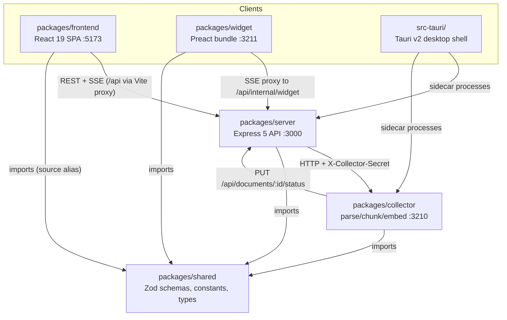
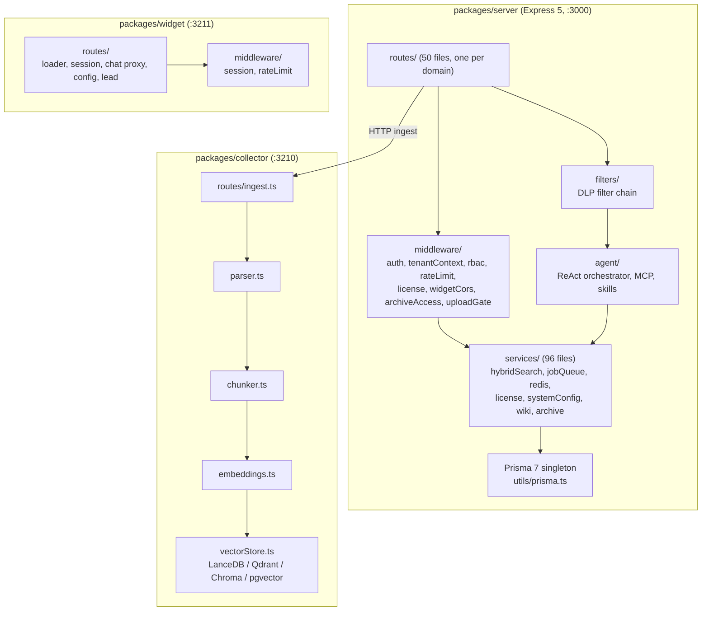

<!-- generated-by: gsd-doc-writer -->

# Architecture

Simmetric Chat is a local-first, air-gap-capable AI chat workspace with RAG, RBAC, and an embeddable widget. It is a pnpm + Turborepo monorepo (Node >= 24, pnpm 11.24.0 pinned via `packageManager` in the root `package.json`) built as a modular monolith (the API server) plus a companion microservice (the document collector), with runtime plugin seams for enterprise and SaaS features.

## System Overview

Three long-running services cooperate over HTTP:

| Service | Package | Port | Role |
|---|---|---|---|
| API server | `packages/server` | 3000 | Express 5 REST + SSE API, RBAC, licensing, agent orchestration, all relational DB access |
| Collector | `packages/collector` | 3210 | Document parse, chunk, embed, vector-store write, status callback; no Prisma/ORM access |
| Widget service | `packages/widget` | 3211 | Public embeddable chat widget API; serves the Preact bundle and proxies chat to the server |

Two client surfaces are served alongside them: the React 19 SPA (`packages/frontend`, dev server on 5173, no Next.js) and a Tauri v2 desktop shell (`src-tauri/`) that runs only the server as a packaged sidecar (`node ../packages/server/dist/index.js` in `src-tauri/src/lib.rs`; the collector is booted only in dev via `beforeDevCommand`) and serves the frontend build (`frontendDist: ../packages/frontend/dist` in `src-tauri/tauri.conf.json`).

The overall style is layered inside the server (routes → middleware → filters → agent/services), strategy-patterned at every external boundary (LLM providers, embedding providers, vector stores), and gracefully degrading for every optional dependency (pg-boss, Redis, collector, plugin packages). Fail-loud is reserved for license/plugin-binary situations and invalid environment configuration.

## Package Dependency Graph

Five workspace packages with a strict unidirectional dependency: **`@simmetric-chat/shared` is the ONLY cross-package import.** Every package may import `@simmetric-chat/shared` (Zod schemas, constants, types — its only runtime dependency is `zod`); no package ever imports server, collector, frontend, or widget code from another package.



Key boundary rules (all verified in the source):

- Each package's `package.json` declares exactly one workspace dependency: `@simmetric-chat/shared: workspace:*`. The server additionally declares `@simmetric-chat/enterprise` as an **optional peer dependency** and `@simmetric-chat/saas` as a `file:` dependency — both resolved at runtime by the plugin loader core (see the plugin seams below); `pnpm-workspace.yaml` disables `autoInstallPeers` so `pnpm install` succeeds without the private packages.
- Server and collector never import each other's code. All server-to-collector calls are HTTP with the shared secret on the `X-Collector-Secret` header (19 code occurrences across 10 production files: `routes/documents.ts`, `routes/archiveImport.ts`, `services/archiveImportService.ts`, `services/wikiEmbeddingService.ts`, `services/vectorCleanupJob.ts`, `routes/system.ts`, `services/dlpDocumentMasking.ts`, `agent/builtinSkills.ts`, `agent/memoryService.ts`, and `agent/memoryRetrieval.ts`). The collector calls back only via `PUT ${SERVER_URL}/api/documents/:documentId/status` and archive-import callbacks (`PUT /api/archives/import/:jobId/callback`; `packages/collector/src/routes/ingest.ts`, `notifyServerStatus`).
- The collector has zero Prisma/ORM usage. Its only Postgres touchpoint is the pgvector provider (`packages/collector/src/services/pgVectorProvider.ts`), which opens a raw `pg.Pool` and queries directly — used only when pgvector is the selected vector-store strategy.
- The shared package's `loadRootEnv()` (`packages/shared/src/config/loadEnv.ts`) is Node-only; the browser bundles must not value-import it (guarded by `packages/shared/src/__tests__/loadEnv.test.ts`).

### Module formats per package

Module formats intentionally differ; respect each package's `tsconfig` `module` setting:

| Package | Module format | Notes |
|---|---|---|
| Root workspace | ESM (`"type": "module"`) | Turborepo task graph in `turbo.json`; root Jest multi-project config `jest.config.cjs` |
| `packages/frontend` | ESM (`module: ESNext`, `moduleResolution: bundler`) | Vite + React 19 |
| `packages/server` | CJS (`module: commonjs`, target ES2022) | Entry `src/index.ts`; exports `createApp()` for tests |
| `packages/collector` | CJS | Entry `src/index.ts` |
| `packages/shared` | CJS | `main: dist/index.js` — server/collector consume the **build**; frontend/widget alias the **source** via Vite/Jest mapping |
| `packages/widget` | CJS service + Preact bundle | `build:widget` produces the gitignored `dist-widget/` |

## Enterprise and SaaS Plugin Seams

Two optional plugin packages extend the server at runtime, both loaded through shared machinery in `packages/server/src/services/pluginLoaderCore.ts` (Phase 186 refactor — the resolver seam, the ctx factory, and the fail-loud semantics live there once):

- **`simmetric-enterprise/`** (`@simmetric-chat/enterprise`, accepted `apiVersion` `[1]`) lives in a separate private repo (IP isolation, air-gap, single-package contract). The community repo imports nothing from it, and it imports only `@simmetric-chat/shared`. Enterprise-provided capabilities are SSO, audit log, white-label branding, backup, and license-limit overrides.
- **`simmetric-saas/`** (`@simmetric-chat/saas`, accepted `apiVersion` `[2]`) is the Phase 186 SaaS plugin seam with the same shape; its `SaaSPluginContext` adds five v2 members (`registerBillingProvider`, `registerQuotaEnforcer` — the one real forward, wired into `middleware/license.ts`'s `requireFeatureLimit`, `registerPlanResolver`, `registerTenantProvisioner`, `issueTenantLicense`).

Loader semantics (byte-identical for both seams, enforced per-loader):

- The loader performs a deliberate **two-step** resolve — `require.resolve(specifier)` followed by `require(modulePath)` (test-injectable via the `__pluginResolver` seam). These two steps must never be collapsed into a single `try { require(name) }` — that would conflate "not installed" with "broken install".
- **Not installed** (`MODULE_NOT_FOUND`): community mode — logged at info level, boot continues.
- **Broken install** (load throws, missing `register`, or `apiVersion` mismatch): fail-loud `process.exit(1)` — a paying customer's broken install must never silently degrade.
- Each plugin receives a `PluginContext` (type in `packages/shared/src/schemas/plugin.schema.ts`): `app`, `prisma` (the singleton, cast through `unknown`), `logger`, `env`, `licenseInfo`, `mountProtected`/`mountPublic` (core applies `authMiddleware` + `tenantContextMiddleware` for protected mounts), `registerScheduler`, `onShutdown`, `registerAuditLogWriter`, `registerConfigKeyValidator`, `overrideFeatureLimit`, `generateToken`, and `encrypt`/`decrypt`.
- Boot order is a test-enforced invariant (`packages/server/src/__tests__/bootOrder.test.ts`):

```
prisma.$connect() -> seedDatabase() -> initLicense() -> seeds/backfills
  -> startJobQueue() -> loadEnterprisePlugin(app) -> loadSaaSPlugin(app)
  -> /api/auth LDAP composite route -> mountCatchAlls(app)
  -> production schedulers -> graceful shutdown hook
```

Plugins load after the license is validated so `ctx.licenseInfo` reflects the current tier; teardown runs in REVERSE load order (SaaS stops before enterprise, both before `prisma.$disconnect()`). The community composite login route (`routes/authLdapComposite.ts`, Phase 193) mounts after both plugins and before the catch-alls so it can serve requests the enterprise LDAP route defers via `next()`; catch-all (404 + error) handlers mount last so plugin routes stay reachable (`mountCatchAlls` in `packages/server/src/index.ts`).

### Managed plugin registry (Phase 202)

Third-party plugins upload as `.zip` via `/api/plugins` (`plugins:manage`, the 40th
permission): six-step install (parse → raw-entry guard matrix → staged extraction →
npm-name validation before slug derivation → probe WITHOUT register → atomic install
+ `PluginInstall` row). At boot, `loadManagedPlugins` runs AFTER `loadSaaSPlugin`
and BEFORE the catch-all mounts, loading enabled rows through a two-step resolver
chain (native `require.resolve` WINS over a managed install of the same slug, then
`createRequire(storage/plugins/<slug>)`) with `failureMode: "fail-soft"` — a register
throw records `status=failed` + `lastError` and boot continues, while the native
enterprise/SaaS loaders keep `process.exit(1)` byte-identically. `licenseMode:
"platform"` rows are gated by `resolvePluginLicense` (closed-enum reasons only)
BEFORE register; none/self rows are never gated. Teardown is managed → SaaS →
enterprise → `prisma.$disconnect` through the single `gracefulShutdown` in
`services/shutdownSequence.ts` (SIGTERM/SIGINT and the `POST /api/plugins/restart`
route all share it).

## Component Overview



Within the server, large domain files are split behind byte-identical facades that must be kept (do not re-merge): `routes/chat.ts` (facade over `chatCrud/chatList/chatExport/chatImport/chatRetention/chatTokens/chatAgentConfig`), `agent/orchestrator.ts` (over `planRunner/modelFallback/toolCallResolver`), and `agent/llmStreaming.ts` (one parser module per provider in `agent/llmStreaming/`).

## Data Flow

### Streaming chat (SSE)

1. The frontend (`useChatStreaming` / `useChat` in `packages/frontend/src/hooks/`, using `@microsoft/fetch-event-source`) POSTs to the chat endpoint. `authMiddleware` and workspace access checks run first (`packages/server/src/routes/chat.ts`, `handleChatStream`).
2. The DLP filter chain runs its inlet pass (`runInlet` in `packages/server/src/filters/filterChain.ts`); matches are post-processed by `services/dlpFilter.ts` + `services/dlpPatternService.ts`.
3. The request enters the ReAct orchestrator (`packages/server/src/agent/orchestrator.ts`, `runAgentStreaming`): resolve provider config, inject plan-mode context if active, then run the skill/tool loop (hard backstop `MAX_ITERATIONS_BACKSTOP = 50`, budget watchdogs in `services/agentBudgetService.ts`).
4. When the `rag_search` skill fires, `hybridSearchWithRerank()` (`packages/server/src/services/hybridSearchService.ts`) runs two legs in parallel:
   - **Vector leg** — HTTP POST to the collector (`COLLECTOR_URL`, `/api/ingest/query`, no secret header — the collector's read-only routes (`/ingest/query`, `/ingest/rerank`, `/ingest/chunks/:documentId`) deliberately require no secret; see the `requireCollectorSecret` comment in `packages/collector/src/routes/ingest.ts`). An embedding-model mismatch guard can skip this leg entirely (FTS-only degradation).
   - **Full-text leg** — `ftsSearch()` (`packages/server/src/services/ftsService.ts`) over a 7-locale concatenated `tsvector` (`searchVectorMulti`) in Postgres.
5. Results fuse via Reciprocal Rank Fusion (`RRF_K = 60` with a deterministic tiebreaker), then a **metadata backstop** (`applyMetadataBackstop`) re-filters against the authoritative `documents` table so `documentTypes`/`dateFrom`/`dateTo` are correct on every vector provider. An optional reranker over-fetches via `services/rerankService.ts` (collector `POST /api/ingest/rerank`).
6. LLM tokens stream through the per-provider parsers in `packages/server/src/agent/llmStreaming/` (ollama, openai, anthropic, gemini). SSE events are emitted as `token`, `status`, `citations`, `done` (carries `model`/`providerType` among `chatId`/`iterations`/`tokenUsage`/`mcpSources`/`doneReason`/`pipeline`; `modelUsed`/`modelProvider` exist only in persisted message metadata — the frontend maps `data.model` → `modelUsed` and `data.providerType` → `modelProvider`), and `error`.
7. With Redis configured, SSE fan-out across multiple server instances uses pub/sub (`publishSSEEvent` → `sse:chat:{chatId}` in `routes/chat.ts`); without it, fan-out is in-process only.

Frontend state follows three tiers: REST server state via TanStack Query (`packages/frontend/src/queries/`), SSE streams via `fetchEventSource` + refs (`hooks/useChatStreaming.ts`), and UI state via React Context (`contexts/` — Chat, Theme, EnterpriseModules, PageMeta). There is no Zustand; `src/stores/` does not exist.

### Document ingestion (RAG pipeline)

1. Upload lands in `packages/server/src/routes/documents.ts` (staged/assigned uploads via `routes/uploads.ts` and `services/uploadDraftService.ts`).
2. Text-poor PDFs route through the server-side vision OCR pipeline (`packages/server/src/ocr/ocrPipeline.ts`); a 10-second polling scheduler with global concurrency 2 (`MAX_CONCURRENT_OCR_JOBS = 2`) is registered in `packages/server/src/index.ts` (`initOcrPipelineScheduler`).
3. The server POSTs the document to the collector (`POST /api/ingest`, gated by `requireCollectorSecret` in `packages/collector/src/routes/ingest.ts`).
4. The collector parses (`services/parser.ts` — PDF, DOCX, PPTX, XLSX, TXT, MD, CSV, YouTube transcripts), chunks (`services/chunker.ts`), embeds (`services/embeddings.ts` — local Xenova (default), hf-local, OpenAI, or Ollama), and writes to the vector store (`services/vectorStore.ts`, `getVectorStore()` singleton; per-workspace collections; archive/wiki pages route to a dedicated `wiki_pages` table).
5. The collector notifies the server: `PUT /api/documents/:documentId/status` with `X-Collector-Secret`. Chunk text is stored in Postgres server-side (both the single-locale `searchVector` and the multi-locale `searchVectorMulti`); the collector never writes relational data. URL ingestion mirrors this via `packages/server/src/urlIngestion/urlPipeline.ts`.

### Background jobs

- **pg-boss** (Postgres-backed queue, singleton in `services/jobQueue.ts`) runs cron-style schedulers: MCP health checks, MCP reaper, synthesis reaper, weekly fidelity sampling, vector cleanup, wiki consistency, upload-draft reaping, chat-message retention, and DLP document scan/backfill. A self-heal guard (`services/pgbossQueueHealthService.ts`) repairs queue-table duplicates before schedulers register. If Postgres is unavailable, `getBoss() === null` and schedulers stay offline with a warning — there is no fallback timer.
- **In-process intervals**: the OCR/URL scheduler and the synthesis scheduler (`services/synthesisService.ts`) poll every 10 seconds (dev and production).
- **Optional Redis layer** (`services/redisService.ts`): rate-limit stores, JWT `jti` revocation, caches, SSE pub/sub, redlock (`services/distributedLock.ts`). Every use degrades gracefully when `REDIS_URL` is absent (`getRedis() === null`).

## Key Abstractions

| Abstraction | Kind | Location | Purpose |
|---|---|---|---|
| `shared` schemas | Zod schemas + inferred types | `packages/shared/src/schemas/*.schema.ts` | The single cross-package contract; handlers validate with `safeParse` |
| Prisma singleton | Module-level singleton | `packages/server/src/utils/prisma.ts` | Only instantiation of `PrismaClient`; driver adapter `@prisma/adapter-pg`; `withSoftDelete()` helper for `deletedAt: null` filters |
| `PluginContext` | Interface (IoC) | `packages/shared/src/schemas/plugin.schema.ts` | Contract handed to a plugin's `register(ctx)`; `SaaSPluginContext` extends it with the 5 v2 members |
| Plugin loader core | Shared two-step resolver | `packages/server/src/services/pluginLoaderCore.ts` | `require.resolve` → `require` via `__pluginResolver`; community vs. fail-loud semantics; consumed by `enterpriseLoader.ts` (apiVersion `[1]`) and `saasLoader.ts` (`[2]`) |
| `VectorStoreProvider` | Strategy | `packages/collector/src/services/vectorStore.ts` | LanceDB (default), Qdrant, Chroma; `PgVectorProvider` in `pgVectorProvider.ts`; swappable via `getVectorStore()` |
| `EmbeddingProvider` | Strategy + pre-flight | `packages/collector/src/services/embeddings.ts` | local/hf-local/openai/ollama with availability pre-flight |
| LLM streaming parsers | Per-provider modules | `packages/server/src/agent/llmStreaming/` | One parser per provider; dispatcher in `index.ts` |
| Filter plugins | Chain + registry | `packages/server/src/filters/` | Pluggable content filters around LLM traffic; DLP registers first |
| Route facades | Split-file convention | `routes/chat.ts`, `agent/orchestrator.ts`, `agent/llmStreaming.ts` | Byte-identical facades over sibling modules; keep the split |
| RBAC / license gates | Middleware | `packages/server/src/middleware/rbac.ts`, `middleware/license.ts` | Every endpoint declares permissions; the auth chain is `authMiddleware → tenantContextMiddleware → permission` (`middleware/tenantContext.ts`); license-gated failures return 402 `{ error, feature, tier }` |

### Prisma soft-delete pattern

All database access goes through the singleton in `packages/server/src/utils/prisma.ts` — never instantiate `PrismaClient` directly, because the singleton owns the `@prisma/adapter-pg` driver-adapter pool and the `globalThis` guard. Soft deletes via a `deletedAt` timestamp are the norm: roughly seventy server files filter on `deletedAt`, and the exported `withSoftDelete(where)` helper keeps `deletedAt: null` where-clauses type-safe without `as any` casts. Hard deletes are the documented exception (for example MCP connection uninstall). Plugin code receives the same singleton through the plugin context rather than creating its own client.

## External Surfaces: Widget vs MCP vs Chat Connectors

Three external chat/tool surfaces feed the SAME agent pipeline, each with a
different trust slot. Terminology (§7.5, used verbatim across docs and code):

- **MCPConnection** — tools the agent *calls* (org-scoped OAuth connections; skills/mcp servers the agent invokes at execute-time).
- **ChatConnector** — an inbound chat channel (Telegram/Discord/Slack/WhatsApp conversation) feeding the same agent pipeline.
- **Widget** — the embedded web chat channel (the public website visitor surface).

| Property | Widget | MCPConnection | ChatConnector |
|----------|--------|---------------|---------------|
| Tenancy slot | Widget row (org-sentinel default) + workspace/archive binding | MCPConnection row (org + optional workspace scope) | ChatConnector row (org-sentinel default) + workspace (KB) binding |
| Auth surface | Per-site widget API key (shared-secret handshake) + HMAC-signed embed | OAuth org connections + MCP transports (OAuth/static-header); connector tools resolve tokens server-side | Platform credentials pasted at create (bot token, signing/app secret, verify token), encrypted per-call, never echoed |
| Session semantics | Per-site visitor sessions (widget session TTL) | No chat session — tool calls ride the chat's ALS tenant window | Persistent ConnectorSession per (connector, platform user), 24h rolling TTL; expired sessions resolve against the SAME Chat (continuity) |
| Sink | Widget SSE chat stream proxied by the widget service | Skill/tool results back into the chat message stream | Platform outbound API (Bot API / REST / Web API / Graph), reply logged as ConnectorMessage out-rows |

One OAuth stack: the ChatConnector Slack install ("Add to Slack") rides the
SAME Phase 195 `oauthProviderRegistry` the MCP connections use — the provider
registry, signed-state service and token lifecycle are shared; the connector
callback writes the token into the connector row instead of an MCPConnection
row and skips the expiry write (Slack bot tokens do not expire).

## Directory Structure Rationale

```
packages/
  shared/       Zod schemas, constants, types; zod is its only dependency.
                Built to dist/ for server/collector; aliased to src/ for
                frontend/widget builds. Exists to guarantee one contract
                across all packages.
  server/       Express 5 API. routes/ (one file per domain), middleware/,
                filters/, agent/ (ReAct + MCP + skills), services/ (business
                logic), ocr/, src/templates/ (seed templates, copied to
                dist/templates by build + Dockerfile.server), prisma/
                (schema + migrations only). The monolith
                concentrates all relational state here.
  collector/    Parse/chunk/embed pipeline. Deliberately dependency-free of
                the ORM so it can be deployed, scaled, and air-gapped
                separately from the server.
  frontend/     Vite + React 19 SPA (admin + chat UI). queries/ (TanStack
                Query), contexts/ (UI state), hooks/ (streaming + shared
                behavior), components/, i18n/ (8 locales).
  widget/       Embeddable widget: an Express service (routes/, middleware/)
                plus the Preact bundle source (src/widget/) served from
                dist-widget/.
src-tauri/      Tauri v2 desktop shell. beforeDevCommand boots server and
                collector; the packaged app runs the server as a sidecar and
                serves the built frontend.
```

The organization follows the deployment boundary: anything that must run in its own container (server, collector, widget) is its own package with CJS builds; anything that ships to a browser (frontend, widget bundle) is ESM/Vite; everything that must stay identical across packages (schemas, constants, permission names, license tiers) lives in `shared` so drift is impossible by construction.

## Architectural Constraints

- **One-way package graph.** Only `@simmetric-chat/shared` crosses package boundaries. Server-collector communication is HTTP + `X-Collector-Secret` only; the ingest request/response contract is pinned by `packages/shared/src/__tests__/ingestSchemas.test.ts`.
- **Optional dependencies must degrade.** pg-boss, Redis, the collector (RAG falls back to FTS-only), alternate vector stores, and the plugin packages all have null-safe fallbacks. Never make them boot-critical.
- **Boot order is test-enforced.** `packages/server/src/__tests__/bootOrder.test.ts` pins the sequence documented above (enterprise before SaaS, both after the license init, catch-alls last); reordering risks plugin routes mounting before the license tier is known.
- **Additive-only migrations.** Schema changes to `packages/server/prisma/schema.prisma` require `pnpm audit:migrations` and a regenerated `docs/MIGRATION_AUDIT.md` in the same PR; destructive migrations need explicit consent. See `docs/MIGRATION_SAFETY.md`.
- **Single runtime config.** The repo-root `.env` is the only runtime environment file (loader: `process.env` > root `.env` > Zod default, in `packages/shared/src/config/loadEnv.ts`). `JWT_SECRET` and `COLLECTOR_SECRET` are strictly required; `DATABASE_URL` has a code default. Infra keys (`JWT_SECRET`, `DATABASE_URL`, ports, URLs) are environment-only; every other system setting resolves DB > ENV > default via `services/systemConfigService.ts`.
- **Vector-store switching requires a restart.** The collector's `getVectorStore()` is a module-level singleton; the provider (LanceDB default, or Qdrant/Chroma/pgvector) is fixed on the first vector operation — the provider name prefers the server's system config (`GET /api/system/settings/vector-db-config`) and falls back to env vars.
- **Graceful shutdown ordering.** MCP connections close, pg-boss drains, and plugin shutdowns run in reverse load order (SaaS then enterprise, 5s cap each) before `prisma.$disconnect()`, inside the outer 5-second shutdown race in `packages/server/src/index.ts`.
## Cost Layer (Phase 203)

Model pricing on ProviderModel (Decimal(18,10)); WorkspaceTokenUsage cost snapshot columns (Decimal(18,6)); modelPricingService TTL-5min cache; cost computed in the orchestrator finally block (fail-open to no-cost); done event + cost endpoints carry the JSON-safe snapshot. See docs/MODEL_COSTS.md.
